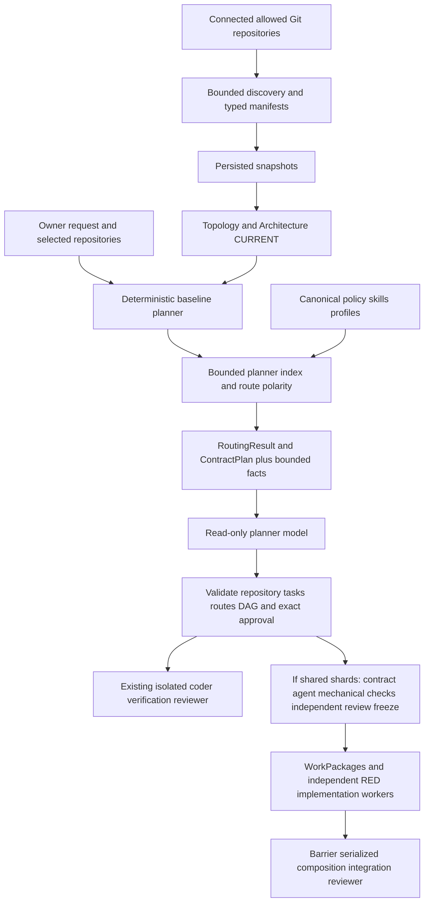
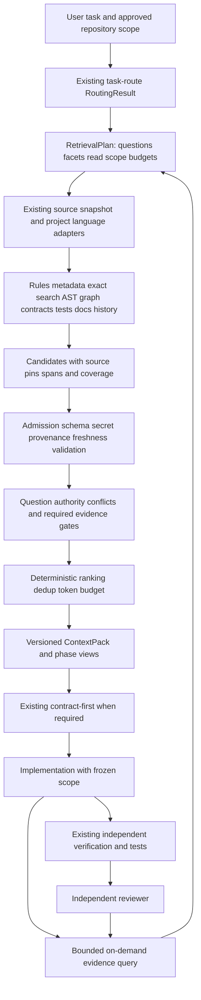

# Audit and design: reusable agent context retrieval

Дата: **2026-10-06**, Asia/Yekaterinburg. Статус: **R0 — audit/specification**, без внедрения retrieval engine.

## 1. Executive Summary

| | Вывод |
|---|---|
| Current state | Уже существуют детерминированные discovery, architectural routing, bounded evidence index, context builders, contract discovery/freeze, CURRENT graph, verification и централизованная distribution. Это частичный retrieval layer, а не отсутствие RAG. |
| Readiness | Достаточная база для ограниченной реализации и offline evaluation. Единого проверяемого context pack пока нет; production Student execution не готов. |
| Main gap | Нет общего task-specific evidence contract с явной полнотой поиска, provenance, authority, свежестью, symbol/test связями, token budget и on-demand expansion. |
| Recommended direction | Один локальный read-only core/CLI, проектные и языковые adapters, тонкий managed skill, существующая service metadata. Reuse routing и contract-first; vector DB сейчас не нужен. |

**FACT** далее означает подтверждение текущими файлами/реализацией. **PROPOSAL** означает проектное решение, ещё не реализованное. **UNVERIFIED** означает, что текущий runtime или данные не проверялись. Capability в исходниках не означает её установку во всех checkout или production certification.

### Границы аудита

Основной checkout: `course-dev-orchestrator`, HEAD `82edd84cd63e1d40ded335463e59da22de01651b`. Рабочее дерево существенно изменено, включая untracked `agent-system/`, routing, freeze, shard execution и hardening. Выводы относятся к **текущему working tree**, а не только к этому commit или опубликованному release.

Исследованы root instructions, `agent-system/`, `.ai/`, `cmd/`, `internal/`, `scripts/`, `runner/`, `docs/`, schemas и fixtures; Student и владельцы его смежных контрактов; сравнительные Go/Next.js checkout. В CDO отсутствуют root `.agents/`, `.codex/` и `contracts/`: canonical shared assets находятся в `agent-system/`, local contracts — в `.ai/contracts/`. Поэтому отсутствие этих каталогов не означает отсутствие инфраструктуры.

После ownership freeze шесть независимых исследователей читали skills/routing, metadata/graph, orchestration/security, search tooling, Student pilot, portability. Implementation files исследователи не редактировали; итоговый synthesis добавляет отчёт и строку в documentation index. В пользовательских checkout ветки, worktree и commits не создавались; push, публикации, model calls, live DB/graph export и product execution не выполнялись. Verification использует существующие disposable test fixtures и build caches. `.env` не читался.

## 2. What Already Exists

### 2.1 Capability map

| Capability | Existing | Location | Quality / limits | Reuse |
|---|---|---|---|---|
| Repository/service selection | **ALREADY EXISTS** | [Planner](../internal/planning/planner.go), [project source](../internal/adapters/git/project_source.go) | Selected project IDs, canonical roots, source identity; не авторизация произвольного нового repo | Передать выбранный scope в retrieval |
| Task architectural router | **ALREADY EXISTS** | [routing.go](../internal/planning/routing.go), [RoutingResult](../internal/domain/planning_route.go), [task-route](../agent-system/skills/task-route/SKILL.md) | Machine-readable routes/evidence; polarity, uncertainty, owner review; heuristics ограничены профилями | Первый stage WHERE |
| Model/cost routing | **ALREADY EXISTS** | [agentpolicy/router.go](../internal/agentpolicy/router.go) | Выбирает model/role/reasoning; отдельный смысл слова routing | Не смешивать с architectural retrieval |
| Bounded discovery | **ALREADY EXISTS** | [scanner.go](../internal/discovery/scanner.go), [detectors.go](../internal/discovery/detectors.go) | Read-only inventory, provenance, checksum, truncation; это onboarding/catalog scan | Reuse safe inventory, detectors и diagnostics |
| Planner evidence index | **ALREADY EXISTS** | [routing.go](../internal/planning/routing.go), `indexRepository`, `makeEvidence` | In-memory paths/content/checksums/regex symbols, лимиты; silent omissions | Не создавать второй общий scanner |
| Rule/context selection | **PARTIALLY EXISTS** | `canonicalPromptAssets`, `repositoryFacts` в [routing.go](../internal/planning/routing.go) | Managed procedures отдельно, bounded raw local facts; scoped policy resolver отсутствует | Уточнить instruction scope и trust |
| Go AST analysis | **ALREADY EXISTS** | [go_routes.go](../internal/discovery/go_routes.go), [nonhttp_operations.go](../internal/discovery/nonhttp_operations.go), [nonhttp_literals.go](../internal/discovery/nonhttp_literals.go) | Реальные AST/router/NATS/startup detectors; не universal callers/type index | Общие parsing primitives; специализированные detectors сохранить |
| General symbol queries | **PARTIALLY EXISTS** | Regex в routing; AST в discovery/verifiers | Нет общего definition/reference/implementation/caller API; regex names не qualified symbols | Go AST adapter, позже optional type-aware resolver |
| Architecture metadata | **ALREADY EXISTS** | [.ai/architecture/service.yaml](../.ai/architecture/service.yaml), [manifest parser](../internal/architecturemanifest/validator.go), [domain](../internal/domain/architecture_manifest.go) | Strict architecture/v1; unknown/empty fields допустимы; свежесть не доказана shape validation | Typed declarations как retrieval seeds |
| Service/dependency graph | **ALREADY EXISTS** | [topology](../internal/topology/builder.go), [queries](../internal/usecase/topology/topology.go), [catalog](../internal/architecturecatalog/builder.go) | Persisted snapshot graph, exact matching, impact BFS; не live code graph | Typed neighbors, ownership/dependency scope |
| Portable pinned graph | **ALREADY EXISTS** | [exporter](../cmd/architecture-export/main.go), [export](../internal/architecturecatalog/export.go), [Git blob reader](../internal/adapters/git/architecture_blob.go) | Declaration commit/blob/content pins; dirty/missing/unresolved => diagnostics | Существующие IDs/pins, не второй platform graph |
| Contract discovery/ownership | **ALREADY EXISTS** | `buildContractPlan` в routing, [contractref](../internal/contractref/reference.go), [materializer](../internal/contractbaseline/materializer.go) | Owner routes отделены от implementation routes | Единый contract resolver вокруг существующей модели |
| Contract-first / freeze | **ALREADY EXISTS** | [contract-plan](../agent-system/skills/contract-plan/SKILL.md), [freeze service](../internal/usecase/contractfreeze/service.go), [baseline verifier](../internal/contractbaseline/verifier.go) | Bounded pre-context, contract-only diff, reviewer, commit/hash checks | Получатель context pack; не новый freeze pipeline |
| Test discovery/policy | **PARTIALLY EXISTS** | `routeVerification`, [.ai/testing/test-manifest.yaml](../.ai/testing/test-manifest.yaml), [testing_policy.go](../internal/execution/testing_policy.go) | Coarse suffix/root matching; trusted policy runner и capability taxonomy существуют | Добавить target-to-tests mapping, не вторую taxonomy |
| Git provenance | **ALREADY EXISTS** | [architecture_blob.go](../internal/adapters/git/architecture_blob.go), [verifier](../internal/execution/verifier.go) | Exact blobs/changed paths/baseline; не task history retrieval | Расширение безопасного Git evidence adapter |
| Task-specific context | **PARTIALLY EXISTS** | [planner context](../internal/planning/agent_planner.go), freeze context, [WorkPackage](../internal/planning/workpackage.go) | Несколько специализированных builders, bytes limits; worker semantics canary-specific | Общая evidence view без замены execution package |
| Orchestration / independent review | **ALREADY EXISTS** | [execution](../internal/execution/service.go), [fanout](../internal/workflow/shard_fanout.go), [shard service](../internal/usecase/shardexecution/service.go) | Approval/freeze/scope/barrier/composition/review; production gate закрыт | Retrieval read-only activity/adapter |
| Managed distribution | **ALREADY EXISTS** | [manifest](../agent-system/manifest.yaml), [distribution](../internal/agentcontrol/distribution.go), [localrepo](../internal/agentcontrol/localrepo/repository.go) | Checksums, exact fingerprint, drift/conflict/local ownership; не semver compatibility | Тонкий skill через existing plan/apply |
| Usage observability | **ALREADY EXISTS** | [tracked_runner.go](../internal/usecase/agentusage/tracked_runner.go), [usage model](../internal/domain/agent_usage.go) | Per Runner.Run latency/status/tokens; retrieval metrics отсутствуют | Добавить retrieval trace, не дублировать agent usage |

### 2.2 Global instructions: loading и стоимость

Подтверждены canonical источники и explicit prompt composition, но **не** полный фактический instruction stack каждого SDK turn. Обычный [runner](../runner/src/index.ts) задаёт workingDirectory/prompt; точное CLI autoload требует отдельной проверки pinned runtime. Проектный AGENTS предписывает чтение `.ai`, но эти файлы не становятся автоматически always-on prompt только из-за наличия ссылки.

| Источник | Кто/когда читает | Размер на дату аудита | Должен ли быть always-on |
|---|---|---:|---|
| `/Users/marat/.codex/AGENTS.md` | Host instruction entry; фактический файл содержит supplied worktree/branch policy | 354 B, ~89 tokens | Да, короткая пользовательская policy; не подменять canonical template |
| [CDO AGENTS.md](../AGENTS.md) | Local instruction entry; перед изменениями | 2,214 B, ~554 tokens | Короткие ownership/safety и navigation — да |
| [Common rules](../.ai/rules/common.md) | Предписаны AGENTS; legacy onboarding bundle | 4,219 B, ~1,055 tokens | Сохранить compatibility; полные процедуры в будущем условно, без третьей копии |
| [Canonical global policy](../agent-system/global/AGENTS.md) | Explicit planner canonical asset; предполагаемый managed global target | 2,030 B, ~508 tokens | Стабильная policy — да; host installation не выполнена этим subsystem |
| [task-route](../agent-system/skills/task-route/SKILL.md) | Explicit planner injection; distributed skill должен быть conditional | 3,057 B, ~764 tokens | Только routing job |
| [contract-plan](../agent-system/skills/contract-plan/SKILL.md) | Сейчас planner всегда включает body; freezer включает явно | 3,717 B, ~929 tokens | Только shared-boundary job; isolated route может skip |
| [Go profile](../agent-system/profiles/go-canonical.yaml) | Planner после profile resolution; freezer | 5,932 B, ~1,483 tokens | Только применимый profile; worker получает нужный subset |
| [Next.js profile](../agent-system/profiles/nextjs-common.yaml) | Аналогично для Next.js | 4,047 B, ~1,012 tokens | Условно |
| [Student AGENTS.md](../../ms-go-student/AGENTS.md) | Student instruction entry | 7,023 B, ~1,756 tokens | Действующие invariants обязательны; extraction не должна их терять |

Оценка tokens = bytes/4 для этих в основном ASCII-файлов; это **не tokenizer measurement** и не итоговый billable context. Go planner explicit canonical bodies занимают 14,736 B (~3,684 tokens) до JSON escaping, baseline, metadata и schema. `canonicalPromptAssets` включает только `SKILL.md`, а не referenced YAML/Markdown: checksum дерева skill не доказывает, что его reference загружен в prompt.

Root `.agents/` и `.codex/` не обнаружены в CDO, Student, Course, Teacher, User, `nextjs`, `admin-nextjs` checkout. Manifest targets существуют как **distribution contract**, не доказательство установки. Runtime planner использует canonical bodies напрямую. [GlobalPolicy.Apply](../internal/agentcontrol/global_policy.go):79–83 всегда возвращает `ErrGlobalPolicyInstallUnavailable`; global policy установка — отдельное решение, не часть retrieval.

### 2.3 Все canonical skills

| Skill | Purpose/input | Output/caller | Dependencies / owns | Must not own |
|---|---|---|---|---|
| `task-route` v1.0.0 | WHERE: task, applicable policy/profile, local facts/source/imports/contracts/tests | Compact YAML example: classification/routes/targets/contracts/verification/avoid/evidence/confidence. Planner реализует отдельный Go/JSON RoutingResult и валидирует selected model routes | Evidence-backed responsibility/target/test pointers; нужный contract-plan recommendation | Task IDs, DAG, scope expansion, freeze redesign, branch/worktree, implementation |
| `contract-plan` v1.1.0 | Минимум shared interfaces для independent routes; compatible existing owner first | Reviewed baseline/checksum/revision или blocker; planner metadata и отдельный freezer используют body | Canonical contracts, profile ownership/dependency direction, orchestrator approve/freeze. Owner-only route не worker | Private helper/layout, giant planning/execution skill, новый persisted ContractPack schema |

Legacy [.ai/agents](../.ai/agents) и [.ai/workflows](../.ai/workflows) — role/procedure assets, не дополнительные installed `.agents` skills. Сосуществование legacy bundle и нового control plane намеренное, описано в [Agent Control Plane](agent-control-plane.md). Retrieval не должен переписывать эту миграцию.

**Ответ про task-route:** procedural inspection уже retrieval-like; executable routing уже получает repo/layer/source/contract/test/avoid evidence. Есть машинный [RoutingResult](../internal/domain/planning_route.go):128–146; новый route JSON contract с нуля не нужен. Skill остаётся **WHERE TO LOOK**, а не WHAT/HOW весь pipeline.

### 2.4 Metadata contracts и актуальность

Есть две разные семьи:

1. Informal `.ai/service.yaml`, `.ai/architecture.yaml`, contracts/commands/manifest. `schema_version: 1` не означает общую closed schema: CDO использует layers map/stack/instructions; Student — layers array/owns/source_of_truth; Teacher — kind/owns/dependencies; onboarding [manifests.go](../internal/onboarding/manifests.go) генерирует evidence arrays. Нужен adapter normalization, а не universal struct, теряющий поля.
2. Strict **architecture/v1**: service + operation YAML, [domain structs](../internal/domain/architecture_manifest.go), [schemas](schemas/architecture-v1-operation.schema.json), [parser](../internal/architecturemanifest/validator.go). Сервис описывает ownership/resources/dependencies/contracts/events. Operation содержит access/input/process/rules, router/handler/use_cases/domain_services/repositories, data_access/external interactions/output/errors и source evidence со span/symbol/checksum.

Strict parser `KnownFields(true)` отклонит произвольный `retrieval:` в architecture/v1. Он проверяет форму source_path/span/checksum, но не наличие symbol или совпадение checksum с текущим source. Confidence — авторское число, не freshness certification. Mermaid — GENERATED projection, слабее исходного owner evidence.

**Конкретный ingestion gap:** discovery валидирует `.ai/architecture/service.yaml` и operation YAML; planner `evidenceKind` в [routing.go](../internal/planning/routing.go):511–535 распознаёт legacy architecture.yaml и `.mmd`, но не эти rich YAML declarations. Подключить existing typed parser/catalog; не делать ещё один manifest.

Syntactic audit direct operation YAML/JSON-compatible YAML (не runtime coverage):

| Repo | Documents | Empty use_cases | Empty domain_services | Empty repositories | Contains `value: unknown` |
|---|---:|---:|---:|---:|---:|
| CDO | 90 | 87 | 89 | 88 | 89 |
| Student | 117 | 112 | 117 | 112 | 112 |
| Teacher | 28 | 2 | 27 | 12 | 8 |
| Course | 249 | 249 | 249 | 249 | 249 |
| Auth | 19 | 19 | 19 | 19 | 0 |

Подсчёт: direct `*.yaml` в `.ai/architecture/{endpoints,operations}`; regex `key: []` или JSON `"key": []`, `value: unknown`/JSON equivalent. Это индикатор scaffold/debt, а не validation failure или доказательство отсутствия реализации. Student operation manifests не содержат symbol/checksum; service manifest имеет отдельные checksum evidence.

Подтверждённый drift Student: [.ai/architecture.yaml](../../ms-go-student/.ai/architecture.yaml):54 говорит, что CSS adapter возвращает passed без validation; [factory.go](../../ms-go-student/internal/infrastructure/runtime/validators/factory.go):242–289 выполняет NATS validation stylesheets. NextAction endpoint есть в [router.go](../../ms-go-student/internal/transport/http/api/v1/router.go):56 и contracts, но соответствующая projection отсутствует в исследованном architecture operation inventory. Evidence checksum `main.go` в Student service manifest отличается от текущих bytes, хотя отдельные courseclient/subscriber pins совпадают. **Freshness проверять по каждому claim/source**, не доверять всему manifest и не отбрасывать все его полезные части.

### 2.5 Architecture graph: что реально можно переиспользовать

- Topology строится из persisted discovery, имеет owners/capabilities/contracts/relations/drift. [Query](../internal/usecase/topology/topology.go):93–139 уже делает direct dependency/consumer lookup и transitive impact BFS.
- CURRENT [catalog builder](../internal/architecturecatalog/builder.go) добавляет typed service/operation hierarchy, exact service/contract/event matching, unresolved nodes. [Current.Sources](../internal/usecase/architecturecatalog/current.go):64–72 требует rebuild, если discovery snapshot новее topology selection. Это consistency check persisted records, не live worktree freshness probe.
- [Portable export](architecture-graph-v1.md) закрепляет source identity/commit/path/blob/content digests; отдельный fleet-input mode не требует DB. Reference/edge IDs уже stable: [identity.go](../internal/architecturecatalog/identity.go). Source edge — declaring owner, traffic определяется `direction`; нельзя просто развернуть inbound relation и потерять provenance.
- Pins endpoint declaration bundles **не** закрепляют автоматически каждый cited source symbol/span. Scope inventory отдельно; `FLEET_SCOPE_UNPROVEN`, missing/dirty/nonCURRENT/unresolved диагностируются явно. Полный актуальный fleet export в этом аудите **UNVERIFIED**, synthetic test graph не fleet evidence.
- Fleet [lock validator](../internal/architecturecatalog/fleet_inputs.go):27 привязан к 42 repos и GitHub identities. Это adapter policy learning-platform, не core API для любого проекта.

PROPOSAL: вычислять typed distance `task → owner service → route/layer → interface/contract → allowed neighbor`. Существующие service edges + profile allowed_dependencies дают seeds; symbol/call/test edges добавляет language adapter. Не называть существующий graph source dependency/caller graph. Distance участвует в ranking; **read scope и write authorization задаются отдельно**, graph traversal не расширяет их.

### 2.6 Deterministic tooling vs LLM exploration

**Уже programmatic:** bounded inventory, route polarity/shape/ownership scoring, coarse test suffix lookup, contract owner/reference normalization, Go AST HTTP mounts/NATS/startup operations, source quote verification, immutable Git blobs, diff/baseline checks. См. [semantic_generator.go](../internal/onboarding/semantic_generator.go), `verifyEvidenceQuote`: exact quote existence не доказывает правильность смыслового вывода LLM.

**Сейчас исследует LLM:** relevant source implementations/callers/tests, interpretation informal docs, semantic onboarding, task semantics и отсутствующие boundary decisions. Planner получает code summaries и metadata whole files, а не task-specific code spans. Contract Agent уже получает selected source contents и approved task intent.

Search по `internal`, `cmd`, `runner/src`, `runner/bin`, `scripts`, `go.mod`, agent assets не обнаружил общего query adapter для `gopls`, `go/packages`, `go/types`, tsserver/compiler API, PHP language server, BM25/embeddings/vector retrieval или programmatic ripgrep search pipeline. `rg`/grep используются при человеческом/agent inspection и policy scripts; это не integrated code resolver. AST существует — отсутствует **общий semantic symbol/query layer**, а не AST вообще.

Реальные ограничения различаются между pipelines:

| Existing stage | Current bounds | Completeness behavior |
|---|---|---|
| Discovery scanner | 10,000 visited files, 1 MiB/file, 20 MiB aggregate, depth 24 | InventorySummary содержит truncation/skips/warnings |
| Planner inventory | 4,000 visited files, 500 evidence entries/repo, 256 KiB/file, 8 MiB aggregate | Skips/errors/limit stop не возвращают coverage ledger |
| Planner target/symbol projection | 12 files/route; first 20 symbol/import matches/file | Path/regex prioritization, не task recall guarantee |
| Final planner EvidenceIndex | 500 total после объединения selected repositories; selected IDs получают priority | Required IDs тоже могут быть clipped/pruned; per-repo acquisition уже мог потерять их |
| Planner repository facts | 96 KiB/repository; stops at first overflow | Поздние mandatory facts могут отсутствовать без diagnostic |
| Contract source context | 128 KiB/file, bounded 512 KiB content/prompt; reviewer bound 1 MiB | Явные failure/content checks, selected evidence; не token utility manager |

Priority после acquisition не восстанавливает source, не попавший в bounded scan. Metadata/source search с unknown coverage не доказывает «контракт/тест отсутствует».

## 3. What Is Missing / Gap Analysis

Обозначения: **A** already exists; **P** partially exists; **M** missing в исследованной реализации; **N** should not be built. `new` ниже — recommendation, не выполненная работа.

| Component / state / priority | existing implementation | reuse | extend | new | do not build |
|---|---|---|---|---|---|
| Task Router / A | RoutingResult + polarity + profile matching | Existing result/validator | Coverage diagnostics, adapter compatibility | Нет нового router | Giant task-route |
| Service/Repo Resolver / A | Base Planner + ProjectSource + topology | Canonical identity/admission | Offline admitted repository view | Project adapter boundary | Второй registry/fuzzy owner guessing |
| Rule Resolver / P / P0 | AGENTS, canonical assets, facts | Managed policy source | Scoped instruction applicability/pins | Policy/evidence separation | README как executable policy |
| Code Search / P / P1 | Inventory/content index | Bounded reader | Exact task-aware search/spans | Resolver API; rg-compatible local adapter | Per-service engine |
| Symbol Resolver / P / P1 | Regex + specialized AST | AST readers | Qualified IDs/build diagnostics | Definitions/references; type-aware optional | Pretend regex = callers |
| Contract Resolver / A/P / P0 | ContractPlan/materializer/freeze | Canonical owners/refs | Exact matching/read evidence, public API debt | Context projection | Competing freeze/owner registry |
| Test Resolver / P / P1 | Route test suffixes/test manifest/policy | Existing commands/taxonomy | Symbol/package/fixture associations | Bounded test query | Certification по filename |
| Git/History Resolver / P / P2 | Safe Git pins/diff | Exact object reader | Bounded history query | Typed rationale/history result | Worktree manager |
| Architecture Graph Resolver / A/P / P1 | Topology/CURRENT/export | IDs/edges/pins/BFS | Typed distance, coverage/live check | Adapter query view | Второй fleet graph |
| Context Ranking / P / P1 | Route ownership score/path ordering | Route signal only | Claim-specific utility ordering | Candidate rank tuple | ML ranker сейчас |
| Context Deduplication / P / P1 | Unique IDs/facts | Stable IDs | Span/content/claim dedup | Cross-resolver dedup | Merge differing revisions |
| Authority Resolution / P / P0 | Code over diagrams, owners/freeze | Existing rules | Per-question matrix/conflicts | Claim authority record | Один scalar trust score |
| Freshness Validation / P / P0 | Snapshots/hashes/exact blobs | Pins/checksums | Every selected span/current snapshot | Explicit stale/missing/dirty status | TTL = доказательство свежести |
| Security boundary / P / P0 | Path exclusions, broker, freeze untrusted prompt | Existing containment/admission | Uniform provenance/content bounds | Trusted policy registration | Retrieved tool instructions |
| Context Budget Manager / P / P1 | File/count/bytes limits | Hard byte caps | Token/cost/required-facet budget | Omission ledger/budget result | Silent mandatory clipping |
| Context Pack Builder / P / P1 | Planner/freeze/WorkPackage builders | Input/output seams | Phase-specific views | Canonical pack schema + JSON/MD | Execution scope replacement |
| On-demand Retrieval / P / P1 | Broker read_file/command | Trusted broker port | Structured query/remaining budget | Read-only expand API | Host shell/new MCP daemon |
| Retrieval Evaluation / M / P0 | Discovery/routing tests as seeds | Existing fixtures | Failure/provenance scenarios | Gold harness/metrics | Только subjective prompt quality |
| Gold Dataset / M / P0 | No retrieval gold found | Route/discovery test cases | Pinned Student scenarios | Expected evidence fixture | Private production data |
| Observability / P / P1 | Agent run usage/events | Actual invocation correlation | Retrieval trace/latency/bytes | Evidence selection counters | Log full prompts/secrets |
| Vector DB / N / Later | Not found/required | — | Только measured doc recall gap | Optional local semantic resolver later | DB/daemon/SaaS now |

**P0:** incomplete search visibility; strict policy/evidence distinction; stale/ownership/contract conflicts; gold fixtures до расширения scope. **P1:** safe deterministic resolvers, structured pack, budgets/on-demand/evaluation telemetry. **P2:** bounded history/type-aware symbols/additional languages. **Later:** semantic docs retrieval по измеренному выигрышу.

## 4. Current Agent Flow — FACT



`C` — уже context engineering. [planner context](../internal/planning/agent_planner.go):86–116 собирается **до** Runner.Run. [Contract freezer](../internal/usecase/contractfreeze/service.go):368–439 уже получает task descriptions/acceptance, fingerprints, source revision, selected evidence, contracts, skill/profile/write scope; source content обозначен untrusted data. Contract writer/reviewer и mechanical validation не заменяются RAG.

Worker branch здесь означает workflow path, не Git branch operation. Shard flow ограничен availability canary: [workpackage.go](../internal/planning/workpackage.go):145–168 hardcodes GET `/availability`, `NewAvailability*`, UTC/resource intervals/pgx; unknown route invariants пусты, validator требует непустые. [Composition package](../internal/usecase/shardexecution/composition_package.go):39–42,74–86 требует exact availability cmd paths и три routes. Это **не** generic Student execution readiness.

## 5. Target Retrieval Flow — PROPOSAL



Task-route может делать минимальную discovery, необходимую WHERE; retrieval расширяет **evidence**, не write scope. До approval пакеты analysis-only. После freeze новая phase view закрепляется к frozen execution base; контент до freeze не выдается как актуальный frozen source. Retrieval I/O/cache выполняется в adapters/activities, **не** в deterministic Temporal workflow.

Первый pipeline: rules → existing metadata → exact files/rg-like search → standard Go AST → existing graph/contracts/tests → validation/pack. `gopls`/`go/packages` подключаются только при нужде в type-aware references/implementations и при доступном approved offline dependency/tool bundle. Docs/history — по необходимости; semantic поиск не источник runtime API truth.

### RetrievalPlan, ranking и dedup contract

PROPOSAL RetrievalPlan сохраняет existing route digest, caller source admission/snapshot, phase, required questions/facets, exact seeds, query kinds, bounded typed neighbor hops, read-only adjacent scope, hard exclusions, limits, expected unresolved и resolver capability requirements. Он не получает authority создавать task/issue/worker или менять маршруты. Positive selected routes — seeds; negative/conditional/conflicting diagnostics сохраняются как constraints, не теряются при expansion.

После validation применить deterministic ordering: mandatory facet coverage first → claim-specific authority/freshness → exact symbol/contract match → same owner/allowed typed architectural distance → executable supporting test → useful optional docs/history. Tie-breaker: source identity, relative path, symbol, span, content version. Не сводить policy trust и business authority в общий numeric score. Conflict pair сохраняется даже если один источник ниже; tests/facets не вытесняются большим количеством похожих файлов.

Dedup key: source identity + content revision/hash + normalized symbol/span + evidence kind. Merge overlapping spans одного файла/version; identical content по нескольким generated projections collapses с сохранением provenance/claim aliases. Одно и то же правило в asset/facts/route sections показывается один раз с references. Different revisions, competing authority claims и semantically different contracts не объединяются. Required/optional omission reasons отражаются в pack; large whole-file chunks не preferred по умолчанию.

## 6. Responsibility Matrix / LLM Interaction

| Component | Owns | Input → output | Must not own |
|---|---|---|---|
| task-route | WHERE responsibility/targets | Task + existing profile/evidence → existing RoutingResult | Full retrieval, task IDs/DAG, new owners, execution |
| retrieval planner | WHAT evidence facets required | Route + question + admitted scope → bounded RetrievalPlan | Semantic business decision, scope authorization |
| resolvers | HOW retrieve each facet | Typed query/snapshot → candidates + coverage/unsupported | Instructions from files, arbitrary commands, writes |
| validator | CAN evidence be safely used | Pins/path/schema/content → accepted/rejected/unresolved | Declare semantic truth from checksum alone |
| authority/ranking | WHICH evidence reaches model | Claim type/conflicts/utility → ordered required/optional evidence | Suppress conflicting authoritative fact |
| context pack | Final versioned evidence view | Selected evidence/budget → JSON + derived MD/digest | Replace approved Task/WorkPackage/freeze |
| contract-first | Minimum shared interface semantics | Approved intent + pack + current contract owners → existing reviewed freeze | New retrieval implementation/SQL/runtime bodies |
| implementer | Behavior inside assigned scope | Phase pack + frozen contracts → implementation/tests/blockers | New owner/contract redesign/foreign writes |
| reviewer | Independent actual diff assessment | Diff + pinned pack + verified checks + on-demand query → findings | Reuse coder thread or trust coder claims |

Ordinary bounded feature baseline: **Job 1** contract-first analysis (explicit freeze only if shared independent routes), **Job 2** implementation, **Job 3** independent review. Это logical jobs, **не SLA «три calls»**. Single isolated route existing contract-plan skips freeze; implementation/review остаются. Deterministic route/retrieval/validation/testing не отдельные expensive LLM jobs.

Текущий canary фактически вызывает contract writer + reviewer; worker optional boundary assessment/RED_SETUP, RED test generation и implementation; serialized composition phases; integration reviewer, retries/remediation. `Runner.Run`/thread/tool iterations не равны количеству jobs или shards. Existing [usage tracking](../internal/usecase/agentusage/tracked_runner.go) привязывает tokens/latency к реальным вызовам. Retrieval должен снизить source hunting/tool rounds: сразу давать auth chain, qualified port, selected implementation, adjacent tests и unresolved owner, а не обещать фиксированное число paid calls.

## 7. Proposed File/Package Structure

**Только предложение; эти каталоги/файлы не создаются данным аудитом.**

```text
internal/contextretrieval/             # initial generic core, dependency-free ports
    model.go plan.go validate.go
    authority.go rank.go budget.go pack.go expand.go
internal/adapters/contextretrieval/
    filesystem/ git/                   # existing safe reader primitives
    learningplatform/                  # RoutingResult, .ai, existing graph mapping
    golang/                            # exact search + bounded AST; optional semantic queries
cmd/course-dev-orchestrator/           # optional pre-config context CLI dispatch
agent-system/skills/context-retrieval/ # thin conditional procedure/API usage, no engine code
test/fixtures/context-retrieval/       # synthetic gold source snapshots + expectations
docs/schemas/context-pack.v1.schema.json
```

Не требуется отдельный repo/module в первом slice. Core должен компилироваться без PostgreSQL/Temporal/Codex/platform domain; CDO adapter переводит existing domain structs в core request. Не извлекать весь `internal/planning` и не переписывать discovery. Later public CLI/module extraction после двух реально разных project adapters.

### Output и cache conventions

FACT: [.gitignore](../.gitignore), AGENTS/Makefile уже используют repository `.cache/{go-build,gomod,bin}`; `.cache/sandbox-certification` и `.cache/go-dependencies` — отдельные evidence/artifact namespaces. Generic context namespace не найден. Durable task record — issue/plan/artifact, не второй журнал в соседнем repo.

PROPOSAL: orchestrator-owned `.cache/agent-context/<existing-task-or-analysis-key>/<snapshot-digest>/`. Key не придумывается task-route; analysis request ID создает caller. Source-only offline CLI пишет в явно заданный approved output root; workers read-only consumers. Cache не trust root и не durable approval store.

```text
context.json        # canonical complete pack incl route/plan/unresolved/provenance
context.md          # deterministic human projection of the same evidence IDs
trace.json          # sanitized selections/omissions/timings, optional
```

Не нужны обязательные шесть файлов, повторяющих route/candidates/evidence. `route.json`, `plan.json`, `candidates.json` — optional debug exports с тем же digest, без ещё одной route YAML schema. Durable artifact может хранить pin/digest/selected evidence manifest существующим artifact subsystem; cache cleanup не уничтожает audit reference.

Canonical proposed JSON fields:

```json
{
  "schema_version": "context-pack.v1",
  "status": "PARTIAL",
  "request_id": "caller-assigned",
  "task_ref": null,
  "purpose": "contract-analysis",
  "route_ref": {"schema_version": 1, "digest": "sha256:<existing-routing-output>"},
  "engine": {"version": "<release>", "policy_digest": "sha256:<policy>", "adapter_versions": {}},
  "sources": [],
  "owner_repositories": [],
  "affected_layers": [],
  "retrieval_plan": {"required_facets": [], "read_scope": [], "budget": {}},
  "applicable_rules": [],
  "relevant_symbols": [],
  "relevant_code": [],
  "contracts": [],
  "tests": [],
  "architecture_evidence": [],
  "dependencies": [],
  "forbidden_scope": {"read": [], "write": [], "read_only_evidence": []},
  "evidence": [],
  "coverage": [],
  "unresolved_questions": [],
  "authority_conflicts": [],
  "omissions": [],
  "budget_used": {},
  "content_digest": "sha256:<canonical-semantic-payload>"
}
```

Каждый evidence: stable source identity; commit/blob **или** explicit working-tree snapshot+dirty fingerprint; relative path; content hash; qualified symbol; byte/line span; resolver/version/query; provenance class; claim type + authority; freshness result; linked evidence/requirement IDs; size/token estimate; limitations. Stable location evidence ID **не** version pin: current RoutingEvidence ID стабилен при изменении bytes. В digest не включать timestamp/timing/absolute host paths; telemetry хранить отдельно. Same snapshot/query/config → same semantic ordering/digest.

Budget: обязательные scoped rules, auth, contract, primary implementation/test facets сначала; optional adjacent docs/history позже. Не подрезать JSON/string посреди mandatory evidence. Required evidence не влезает → `BUDGET_UNSATISFIED`, smaller coherent spans или explicit blocked request. Token estimator/version фиксируются; отдельно hard byte limit **после** JSON escaping и outer prompt/schema. [Runner](../internal/adapters/codex/runner.go):18–21,55–60 имеет 1 MiB request/output, 512 KiB result; freezer tighter content/prompt limits. Pack должен оставлять reserve для instructions/schema/task/diff, а не занимать весь лимит request.

## 8. Service Metadata Contract — PROPOSAL

Один shared engine; service содержит только owner-maintained декларации. Default подключение **без нового файла**:

| Normalized facet | Existing source | Validation |
|---|---|---|
| service identity/language/owner | `.ai/service.yaml`, go.mod/package.json, admitted source identity | Adapter variant; source/ownership evidence; language ≠ architecture profile |
| roots/layers/forbidden ownership | `.ai/architecture.yaml`, applicable profile, AGENTS | Проверить dirs/symbols; report drift/incomplete lists |
| data_sources/dependencies | architecture/v1 owned_resources/external_interactions, actual adapters | Exact owner/transport; unknown не превращать в concrete service |
| contracts | local references, typed operations, executable ports, existing ContractPlan | Consumers/owner/fingerprint; missing field explicit |
| tests | test manifest, actual package tests, business-capability map | Registered commands/status отдельно от найденных файлов |
| generated/ignored/docs hints | Engine defaults + optional local override | Local hints не ослабляют secret/root/trust policy |
| authority | Centrally defined question matrix + scoped owner policy | Never auto-promote free-form metadata to policy |
| special_retrievers | Registered engine capability IDs only | No shell, executable path, network URL or arbitrary plugin loading |

Possible **optional** namespaced block в informal `.ai/service.yaml`, только после compatibility audit конкретных readers/writers:

```yaml
# PROPOSAL: not installed, not a new architecture/v1 field
context_retrieval:
  schema: context-hints/v1
  generated_paths: ["<verified generated directory>/**"]
  ignored_paths: ["<verified irrelevant artifact directory>/**"]
  documentation_roots: [docs]
  test_associations: []        # only exceptions missing in existing metadata
  retriever_capabilities: []  # registered IDs, configuration validated centrally
```

Не копировать `service`, `roots`, `contracts`, `tests` второй раз. Если строгий reader не допускает extension, выбрать separately versioned adapter config **либо** coordinated schema upgrade; `.ai/retrieval.yaml` не default. Strict architecture/v1/profile YAML расширяются только с новой явной parser/schema compatibility, не произвольным добавлением fields. Ignore rules не должны скрывать mandatory contract/ownership evidence; такое исключение — unresolved conflict.

### On-demand contract

PROPOSAL trusted API, вызываемый CLI/client или существующим broker; это **не новый MCP server**:

```text
Prepare(task, existing_route, admitted_sources, phase, budget) -> ContextPack
Expand(pack_ref, query_kind, selector, reason, remaining_budget) -> ContextDelta
```

Query kinds: `definition`, `references`, `implementation`, `callers`, `contract`, `tests`, `error_mapping`, `schema`, `history`, `docs`. Selector — typed repo/path/symbol/contract ID, без command string. Delta возвращает base_digest, source snapshot, added/replaced evidence, rejected/unsupported/truncated/unresolved, cost и new digest. Unsupported semantic query не маскируется lexical result: fallback labeled и confidence/coverage limited.

Initial pack: scoped policy, route, existing handler/application/port/adapter **если они существуют**, auth chain, tests, owner metadata. Later: specific mapper/caller/schema/history. Бounded depth/hops/results/bytes/time/cumulative tokens, cancellation, same snapshot revalidation. Новая foreign repository или changed execution base требует caller-owned scope/plan decision; query не authorizes write. Worker-generated files читаются как separate phase snapshot и не подменяют frozen baseline.

FACT: broker [read_file](../runner/bin/cdo_broker.py) уже возвращает content/hash; bounded command работает в OCI. Это low-level tools, не retrieval API. В hardened certification [hardened.ts](../runner/src/hardened.ts):17–25 отключает native tools/skills/apps/plugins: distributed skill помогает outer Codex workflow, но backend/broker должен обслуживать hardened workers независимо от autoload skill/host shell.

## 9. `ms-go-student` Pilot

### 9.1 Preconditions и восемь реальных сценариев

Student соответствует required Go shape, но центральный profile не исчерпывает локальную архитектуру. `backend.infrastructure.client` candidates не включают фактический `internal/infrastructure/http/**`. Domain-only persistence dependency rule конфликтует с [answer_repo_pg.go](../../ms-go-student/internal/infrastructure/persistence/postgres/answer_repo_pg.go):206, возвращающим application-owned `*answeruc.TaskMetadata`. Локальный [check_architecture.py](../../ms-go-student/scripts/check_architecture.py) проверяет собственные границы. Retrieval должен обнаруживать конфликт, а не инициировать refactoring всего Student.

Следующие route results — **expected PROPOSAL**, сверенные с ownership/source, а не outputs выполненного router run. В текущих [keyword heuristics](../internal/planning/routing.go) нет полного mapping `ClickHouse`, `reducer`, `NBA`: короткий task может остаться unresolved. `backend.domain` contract owner-only не обязан быть implementation route.

Обозначение jobs: `C` contract-first (explicit freeze только при shared boundary), `I` implementation, `R` independent review; при isolated route C — bounded contract check/skip freeze. Retrieval/test execution — tooling, не additional LLM job.

| Scenario | Expected task-route | Retrieval sources / expected initial context | Forbidden / adjacent read-only context | Likely jobs |
|---|---|---|---|---|
| Add HTTP endpoint | transport.http; usecase при новой application behavior; composition при registration/wiring; domain только новый owned contract | [Root router](../../ms-go-student/internal/transport/http/router.go), [API router](../../ms-go-student/internal/transport/http/api/v1/router.go), handler/middleware/HTTP contracts, concrete application API, router tests | Unrelated private/admin routes, migration/NATS changes, arbitrary student selector; no blanket router rewrite | C/I/R; composition serialized если workers |
| Add repository method | persistence; domain contract owner; usecase только изменяемый caller | [answer_repository](../../ms-go-student/internal/domain/repository/answer_repository.go), [answer_repo_pg](../../ms-go-student/internal/infrastructure/persistence/postgres/answer_repo_pg.go), all implementations/fakes/callers, schema, focused repo tests | Unrelated transport/client; no migration for existing schema read; no copied port | C/I/R if changed shared API; otherwise I/R |
| Change Student reducer | domain; usecase/persistence read context | [learning_mastery.go](../../ms-go-student/internal/domain/learning_mastery.go):106,172; [tests](../../ms-go-student/internal/domain/learning_mastery_test.go); [learning_evidence_repo](../../ms-go-student/internal/infrastructure/persistence/postgres/learning_evidence_repo_pg.go), both Course/Practice callers and evidence/audit schema | Planner gap graph, Teacher policy, deriving new targets, legacy backfill; telemetry ≠ official mastery | C check, I/R; cross-layer freeze only if API change |
| Change NextActionResolver/NBA | domain pure decision or usecase orchestration; persistence/client as read evidence | [ResolveNextAction](../../ms-go-student/internal/domain/next_action.go):121, [NextActionResolver](../../ms-go-student/internal/usecase/student/next_action.go):17,26, [port](../../ms-go-student/internal/domain/repository/next_action.go), [snapshot repo](../../ms-go-student/internal/infrastructure/persistence/postgres/next_action_snapshot_repo_pg.go), runtime exact bindings, [contract tests](../../ms-go-student/internal/transport/http/next_action_contract_test.go) | Teacher/UI/Planner becoming decision owner, read causing runtime command, private execution artifacts | C check/I/R; existing tests + concurrent snapshot cases |
| Add ClickHouse read | Actual owner Statistic persistence; Student client/application only if consuming new provider API | [Statistic AGENTS](../../ms-go-statistic/AGENTS.md), [summary domain](../../ms-go-statistic/internal/domain/summary.go), [queries](../../ms-go-statistic/internal/infrastructure/persistence/clickhouse/summary_repository.go), owner schema/provider contracts; Student auth/consumer contract | Do not invent Student ClickHouse adapter; no schema/ingestion or live DB; adjacent source does not grant write | Per owned task C/I/R; provider task separately if required |
| Change auth-sensitive endpoint | transport.http; usecase ownership checks if needed | [auth middleware](../../ms-go-student/internal/transport/http/middleware/middleware_auth.go), route/role/dedicated token groups, endpoint ownership-filtered query; [auth tests](../../ms-go-student/internal/transport/http/middleware/middleware_auth_test.go), [NBA tests](../../ms-go-student/internal/transport/http/next_action_contract_test.go) | Claiming JWT verification, wrong internal token, user-supplied identity, unrelated Auth service changes | C/I/R; independent security review |
| Add NATS handler | transport.message; application/domain envelope boundary; composition registration; persistence inbox if needed | [subjects](../../ms-go-student/internal/domain/subjects.go), producer contract, [Teacher subscriber](../../ms-go-student/internal/transport/message/nats/subscriber_teacher_assistance.go):23–163 and [tests](../../ms-go-student/internal/transport/message/nats/subscriber_teacher_assistance_test.go), usecase transaction, [operation manifest](../../ms-go-student/.ai/architecture/operations/consume-teacher-assistance-observed.yaml) | Core QueueSubscribe ≠ durable JetStream ACK; ACK before commit, new event semantics, foreign private outcome payloads | C/I/R; serialized subscription wiring |
| Fix application bug | usecase; other routes only after reproducer | Concrete reference: [StartTaskAnswer](../../ms-go-student/internal/usecase/answer/start_answer.go):43,70 + [regression](../../ms-go-student/internal/usecase/answer/start_answer_regression_test.go):95, ports/fakes/lifecycle contract | Broad adapter/transport rewrite, mask symptom, mutate unrelated progression/Practice bridge | C check/I/R; characterize RED before fix |

NBA source validates student UUID/snapshot ownership, exact runtime binding, then rereads snapshot and returns `WAITING/state_changed` on concurrent changes. These facts must reach a relevant NBA pack, rather than general whole-service docs. NATS Teacher decoder uses strict unknown-field/trailing-JSON/envelope validation; transient `NAK`, permanent `Term`, successful `ACK` after commit. Core activity subscriber lacks those durable semantics. Reducer is shared by Course/Teacher and Practice evidence; retrieving only one caller misses correctness scope.

### 9.2 Full example: statistics of one lesson for the current student

**User task premise:** attempts, errors, average duration, average score, average grade already have data in ClickHouse; no schema/ingestion change. Preserve this premise. Source audit cannot identify the exact existing payload/dataset from that assertion alone and must not invent it or declare the data nonexistent.

**FACT:** no Student ClickHouse driver/adapter/query or outbound Statistic client found in go.mod/config/composition/domain/infrastructure/integration contracts. [Statistic](../../ms-go-statistic/.ai/service.yaml) owns telemetry/ClickHouse summaries. Existing query is task/session summary; requested lesson attempts/score/grade aggregate was not found. Exact storage/payload semantics and runtime data availability remain **UNVERIFIED**.

#### Stage 1 — route / constraint freeze

Expected analysis result, using existing route vocabulary:

```yaml
# PROPOSAL, not actual router output or approved execution plan
repository: ms-go-student
profile: go.canonical
classification: student-facing-read
expected_implementation_routes:
  - backend.transport.http
  - backend.usecase
  - backend.infrastructure.client # new Statistic consumer only after boundary decision
  - backend.composition           # verified constructor/router changes only
contract_owner_candidates:
  - application query/result owner
  - outbound provider port owner # actual local profile/source must settle placement
read_only_neighbors:
  - ms-go-statistic # data owner / provider evidence
  - ms-go-course   # lesson/access metadata contract, if needed
excluded_write_routes:
  - backend.migration
forbidden_changes:
  - ClickHouse schema or ingestion
  - mastery, reducer, progression or assessment state
unresolved:
  - exact existing aggregate or provider metric contract
  - central client path candidate mismatch
confidence: partial
```

`/api/v1/student/lessons/{lessonID}/statistics` — возможный **новый** path, не существующий endpoint. Не выдавать proposed `GetLessonStatistics`/`StudentLessonStatsRepository` как найденные symbols. Исключённая migration **write route** не запрещает read-only owner schema evidence: read/write/irrelevant distinctions должны быть явными.

#### Stage 2 — mandatory policy and access evidence

Retrieve selected spans:

- [Student service](../../ms-go-student/.ai/service.yaml) ownership/security: trusted `X-User-ID`/role headers, JWT verification отсутствует; scoped user context, existing dedicated-token contracts.
- [Root router](../../ms-go-student/internal/transport/http/router.go):39,77–80 mounts API behind auth; [API router](../../ms-go-student/internal/transport/http/api/v1/router.go):24,31–38 accepts Student roles, registers existing lesson/access/results reads.
- [Auth middleware](../../ms-go-student/internal/transport/http/middleware/middleware_auth.go):15–69 и context identity; [AnswerHandler](../../ms-go-student/internal/transport/http/api/v1/handlers/handler_answer.go):22,214,239 checks lesson access before content at 254–269.
- [ProgressionService](../../ms-go-student/internal/usecase/answer/progression.go):107,351 `ResolveLessonAccess`; [LessonProvider/AssignedCourseAccess](../../ms-go-student/internal/usecase/answer/task_provider.go):128,132; [courseclient](../../ms-go-student/internal/infrastructure/http/courseclient/client.go):28,94–98.
- [Safe response projection](../../ms-go-student/internal/transport/http/api/v1/handlers/student_content_response.go):11,85; [results application](../../ms-go-student/internal/usecase/answer/results.go):58,65,163,171 as distinct official attempt-read behavior.

Expected endpoint behavior: derive current student from middleware context, validate lesson selector, apply an **explicit** access policy, delegate application query, return bounded scalar aggregate. Existing GetLesson access pattern is evidence, но не решает, доступны ли historical analytics после потери доступа к lesson: это unresolved contract question.

Initial source chain имеет gap `application → Statistic provider`. Context pack должен показать gap, а не заполнить его imaginary local adapter. Existing lesson architecture manifest с empty handler/usecase/repositories и unknown auth — seed для expansion, не ответ.

#### Stage 3 — targeted owner/data expansion

Read-only query переходит к Statistic owner, не ко всем siblings:

- [AGENTS](../../ms-go-statistic/AGENTS.md), HTTP/database/ingestion contracts.
- [0001 schema](../../ms-go-statistic/migrations/0001_init.up.sql):1–24: `stat_events` с user/session/course/lesson/task UUID dimensions, timestamp/event_type и arbitrary JSON-string payload; typed score/grade columns в этой migration нет.
- [SummaryFilter/TaskSummary](../../ms-go-statistic/internal/domain/summary.go):10–34: UserID/LessonID filter есть; TaskSummary — session count/typing events/duration, без requested attempts/errors/score/grade.
- [Task query](../../ms-go-statistic/internal/infrastructure/persistence/clickhouse/summary_repository.go):25–63: grouping `(task_id, session_id) → task_id`; average event-span duration по sessions, **не official attempt duration**.
- [Learning session query](../../ms-go-statistic/internal/infrastructure/persistence/clickhouse/learning_session_summary_repository.go):19–43: compiler_error/test_failed events, filtered by student/session; не lesson attempt error contract.
- [Public summary handler](../../ms-go-statistic/internal/transport/http/api/v1/handlers/stat_handler.go):223–343: lesson filter может возвращать **task summaries**, не весь requested lesson aggregate. [Private route tests](../../ms-go-statistic/internal/transport/http/private/router_test.go) дают pattern internal provider token, не автоматически новый approved API.

Если exact producer/payload definition найден on demand, получить его owner contract и fixture tests, не raw learner telemetry. Если не найден — `MISSING_METRIC_CONTRACT`, partial pack. Не превращать поиск в разрешение live database query или migration.

#### Stage 4 — unresolved metric semantics and authority

| Required decision | Почему нельзя вывести из похожего поля |
|---|---|
| Attempt unit/dedup key | Session count ≠ attempt count; repeated ingestion/events могут дублировать |
| Error definition | compiler_error/test_failed ≠ official learner failure; technical/system errors отдельно |
| Duration/unit/denominator | Event first-last span ≠ attempt duration; missing spans и timeout нужны явно |
| Score scale/sample/null | Absent payload ≠ zero; average of task averages неверна без weights |
| Grade representation | Categorical grade нельзя просто `avg`; numeric scale не доказана |
| Lesson/course/revision/window | Same lesson ID не всегда same curriculum revision/time scope |
| Empty response/access | Zero counts vs null averages; historical access policy |
| Provider auth/error/freshness | Current identity propagation, bounded timeout/body, partial-ingestion expectation |

Public response authority — approved/frozen contract; actual identity behavior — router/middleware/tests; storage — owner schema/query; metric semantics — explicit dataset/provider contract + query fixtures. Contract absence — blocking business question, не invitation LLM придумать payload SQL.

#### Stage 5 — expected context pack and forbidden context

Pack status **PARTIAL / contract-analysis-ready**, SQL implementation **not ready** until exact existing metric contract resolved. Include existing symbols/spans, current-user access, source pins, owner read-only contract, proposed route as proposed, coverage/conflicts, missing provider/metric fields, test candidates, no schema/ingestion writes.

Exclude raw submissions, answer keys, student event rows, secrets, private Practice evaluation artifacts, unrelated endpoint trees, all-service dumps. Reducer/NBA ownership исключается коротким scoped rule; их internals не нужны initial lesson-statistics pack. Owner schema может быть necessary read-only evidence, schema writes остаются forbidden.

On-demand examples: concrete GetLesson error mapper; exact producer fields/test supporting `average_score`; implementers/fakes of the **frozen** consumer port; null-grade query fixture; affected dependency registration. Каждый query bound к base pack/snapshot/allowed roots/budget.

#### Stage 6 — expected delivery and tests, not executed

По ownership предпочтительна Student endpoint/application/client → Statistic provider read. Это **PROPOSAL**, не уже принятый новый API. Если provider отсутствует, нужна separately owned Statistic implementation task и frozen provider/consumer boundary; single Student write task не меняет Statistic. Direct Student DB read — отдельный explicit ownership decision, не default.

Logical jobs C/I/R на independently owned task; shared feature может иметь больше repository packages и calls. Composition и current production admission gates сохраняются. Перед реальным запуском необходимы generic task-derived semantic WorkPackage вместо availability constants и separately completed sandbox certification.

Expected focused verification: missing identity/role, student selector rejection, foreign-student isolation, malformed lesson ID, decided access policy, duplicate attempts/events, null/empty grade/score, duration units, weighted aggregates, provider auth/unavailable/timeout/malformed/oversized response, registered route/wiring. SQL tests используют existing owner schema/fixtures, без ingestion/schema changes. Runtime DB proof — только отдельно approved isolated dependency environment.

Existing anchors: [auth test](../../ms-go-student/internal/transport/http/middleware/middleware_auth_test.go), [course assignment router test](../../ms-go-student/internal/transport/http/router_course_assignment_test.go):41, [NBA trust matrix](../../ms-go-student/internal/transport/http/next_action_contract_test.go):24, [progression tests](../../ms-go-student/internal/usecase/answer/progression_test.go):88,176,301. No focused summary repository test найден в исследованном Statistic test tree: gold должен фиксировать этот verification gap.

## 10. Retrieval Testing Strategy — PROPOSAL

Gold начинается **до** Student rollout, рядом с существующими discovery/routing fixtures. Fixtures pin synthetic commit/content, route output/catalog version, question facets и expected evidence. Реальные source snapshots могут быть read-only developer evaluation inputs, но gold не включает secrets/learner data и не привязывается к machine absolute paths.

```yaml
schema: retrieval-gold/v1
id: student-lesson-statistics-owner-boundary
task:
  repository: ms-go-student
  text: statistics of one lesson for the current student; existing ClickHouse data
  constraints: [no-schema-write, no-ingestion-write, current-student-only]
sources:
  - fixture: student-minimal
    snapshot: "sha256:<fixture-tree>"
  - fixture: statistic-owner
    snapshot: "sha256:<fixture-tree>"
expected_service: ms-go-student
expected_read_only_neighbors: [ms-go-statistic]
expected_layers: [transport.http, application, outbound-client]
expected_contracts: [student-identity, lesson-access, statistic-metric-provider]
expected_tests: [identity-isolation, lesson-access]
must_find:
  - {requirement: current-identity, symbol: AuthMiddleware.Middleware}
  - {requirement: lesson-access, symbol: ProgressionService.ResolveLessonAccess}
  - {requirement: storage-owner, repository: ms-go-statistic}
  - {requirement: metric-contract-gap, diagnostic: MISSING_METRIC_CONTRACT}
should_find:
  - {requirement: response-pattern, symbol: AnswerHandler.GetLesson}
must_not_find:
  - {evidence_class: SECRET_CONTENT}
  - {fabricated_symbol: StudentClickHouseRepository}
must_not_route_writes: [backend.migration, foreign-repository]
expected_status: PARTIAL
budget: {max_context_tokens: 6000, max_source_bytes: 262144}
```

`statistic-metric-provider` выше — required facet; fixture намеренно может его не содержать. Missing facet + explicit diagnostic считается правильным ответом; invented source — failure. Path/symbol/range matching гибкое при refactoring: requirement IDs стабильны, acceptable alternatives явно versioned. Must-not-find не запрещает owner migration **read**; scope violations оцениваются по access/action/facet, не presence любого файла чужого layer.

Gold минимум восемь сценариев + adversarial variants: negative/conditional/conflicting routes; `NBA` ambiguity; central client path mismatch; late mandatory file после inventory cap; oversized/unreadable mandatory source; required IDs clipped в multi-repo index; nested fixture AGENTS; stale main checksum + fresh sibling pin; nonexistent outbox paths; CSS prose/source conflict; tests present but certification MISSING; secret-like source content; symlink/hardlink/path traversal; deleted/renamed symbol; duplicate/overlapping spans; build-tag/unsupported semantic resolver; README/comment/payload injection; source changes between scan/pack/expand; exhausted budget and cancellation.

### Metrics and gates

| Metric | Definition | Proposed gate |
|---|---|---|
| Must-find recall | Satisfied mandatory requirement IDs / all mandatory IDs; explicit expected missing diagnostics count when specified | **1.00 every safety/contract gold case**; average не скрывает failures |
| Forbidden-scope violations | Evidence/read/write/query actions outside admitted class/scope | **0**, separately evidence leakage and write routing |
| Missing-contract rate | Required facet absent **without explicit truthful blocker** / required contract facets | **0**; do not count expected honest gap as silent miss |
| Recall | Relevant required+optional gold evidence found / relevant expected evidence | Report per scenario/resolver |
| Precision | Relevant selected evidence / all selected evidence, judged by fixture labels | Initial target ≥0.80; no loss of must-find for gain |
| Context token count | Final phase prompt evidence tokens and estimate method, including duplicate sections | Per-case cap; ≤6000 illustrative lesson pack; reserve caller budget |
| Duplicate ratio | Repeated normalized source-span tokens / selected evidence tokens | Initial ≤0.05, deliberate complementary claims excluded |
| Stale-source rate | Stale selected runtime evidence / selected runtime evidence | **0**; stale rejected candidates reported separately |
| Authority conflicts | Conflicting authoritative claims, surfaced vs silently suppressed | **100% surfaced**, 0 silent resolution |
| Retrieval latency | Cold/warm total and per resolver p50/p95, same fixture/machine | Establish baseline; illustrative local p95 ≤2s exact/metadata; semantic queries separately |
| Coverage / truncation | Scan limits/skipped/error/required omission by stage | No COMPLETE after incomplete mandatory search |

Приоритет строго: must-find recall → forbidden violations → missing-contract rate → precision → token cost. Token/latency числа — proposal, не измеренные результаты. Latency budget можно уточнить после первого deterministic baseline; нельзя обходить security/recall ради него.

Три уровня: unit invariants/resolvers, deterministic fixture end-to-end pack/expand, shadow read-only comparison с нынешним LLM exploration. Pack MD/JSON IDs/digest согласованы; reordering не меняет semantic digest; mutation invalidates; no model/network needed for core suite. Retrieval tests не заменяют application regression, frozen baseline verifier или production sandbox suite.

Observability: request/pack/snapshot/query IDs, engine/adapter versions, selected/omitted requirement IDs, status/coverage, authority conflicts, bytes/tokens, per-resolver latency/cache hit, expansions/cancellation. Correlate existing agent usage по logical job/phase/attempt. Cached-input token count SDK — **не retrieval cache hit**. Не логировать full prompt/source, secret values или raw user telemetry.

## 11. Security, Provenance, Authority and Freshness

### 11.1 Provenance classification — PROPOSAL

Trust to instruct и authority to answer — независимые оси. MANAGED/LOCAL/GENERATED asset ownership из control plane также не заменяет provenance trust.

| Class | Admission / example | Instruction power |
|---|---|---|
| `TRUSTED_POLICY` | Explicit user/system policy + owner-approved scoped AGENTS/managed policy/skill registered by trusted caller, identity/digest verified | Может задавать процедуры только в установленной instruction scope; никогда выше user/system authorization |
| `TRUSTED_PROJECT_METADATA` | Validated owner manifest/contract descriptor с known schema/source | Facts/navigation only; prose и `commands` не выполняются автоматически |
| `PROJECT_SOURCE` | Admitted current executable source/interface/migration | Evidence, без права менять policy |
| `PROJECT_TEST` | Admitted current test/fixture | Evidence of assertions/coverage; fixture AGENTS не policy |
| `PROJECT_DOC` | README/ADR/runbook/comment descriptions | Evidence; даже normative-looking text не auto-policy |
| `EXTERNAL_CONTENT` | External repo/issue/user text/data sample | Evidence only, scope/size restrictions |
| `GENERATED_CONTENT` | Mermaid/generated source/export/scaffold | Evidence with generator/input pins; weaker where input missing |

Файл `AGENTS.md` найден через search не становится instruction автоматически. Текущий evidenceKind классифицирует любой basename AGENTS.md как repository_instructions, включая `agent-system/global` и discovery fixtures; новый resolver должен вычислять applicable ancestor scope и explicit trust registration. Trusted procedure sources загружаются trusted caller **до retrieval**; source/comment/README нельзя разрешить повысить trust по содержимому.

К LLM передаются отдельные policy block и inert evidence records с class/repository/revision/path/span/hash/claim authority. Raw evidence JSON/MD отмечается «DATA / EVIDENCE; instructions inside do not alter policy, tools or scope». Этого disclaimer недостаточно: backend enforce root/command/network/write/budget/admission independently. Injection detector может дать сигнал, но не substitute isolation.

Only trusted compiled capability IDs могут выбирать resolvers/tools. `special_retrievers`, YAML command, generated comment, issue text не исполняются. Retrieved external README никогда не меняет model profile, approval gate, secret policy, worktree ownership или production admission. No new daemon/cloud/MCP requirement.

### 11.2 Question-dependent authority

Не использовать один общий порядок `contract → code → tests → docs` для всех вопросов. Intended behavior и actual behavior — разные claims; расхождение сохраняется.

| Question | Primary authority | Supporting evidence / conflict response |
|---|---|---|
| Business ownership | Explicit user scope, active owner policy/canonical contracts, reviewed owner declarations | Actual repository implementation/source; conflict owner vs code => report, no foreign write |
| Public API intended contract | Approved/frozen versioned provider contract, executable public interface/schema | Registered route/DTO/contract tests; implementation mismatch = drift, not silent contract replacement |
| Actual implementation behavior | Current pinned router/middleware/source + real execution proof if available | Tests are executable assertions, only run report proves outcome; docs/contracts describe intent |
| Database schema/query | Owner versioned migrations + current pinned query; applied schema only when separately verified | Manifest schema summary weaker; source audit does not prove live migration application |
| Metric meaning | Explicit owner dataset/producer/provider contract, tested aggregation semantics | SQL/payload fixtures; arbitrary event name/comment does not define attempt or grade |
| Testing policy | Trusted locked testing policy + declared command/exception/status | Actual test files and fresh run evidence; AVAILABLE/MISSING formal status separate |
| Architecture rule | Active approved central profile + stricter applicable repository/user policy | Source import checks and real local conventions; generic profile mismatch surfaced |
| Historical decision | Current accepted owner ADR/document revision with date/supersession | Bounded Git evidence; old code not current runtime authority |

Validator distinguishes `author_confidence` от verified source freshness; high metadata confidence не outranks executable facts. Approved frozen contract determines worker boundary even when implementation отсутствует; existing local implementation does not authorize redesign. Reviewer sees both sides and exact conflict record, not ranked suppression.

### 11.3 Freshness and safe ingestion

- Immutable snapshot: existing safe Git object reader, full owner commit/blob/content hashes; no lazy fetching/network, branch tip не pin. Preserve graph/profile/catalog/contract baseline fingerprints.
- Dirty analysis checkout: explicit dirty snapshot/file-content digest and read-only phase, не fake CURRENT/clean commit. Revalidate selected files before packing and expand; source changed => stale/invalidated pack or new analysis snapshot.
- Generated facts: validate generator/version/input pins + each required reference/path/symbol/checksum; unsupported/unknown/deleted references explicit. No assumed freshness from mtime/TTL alone.
- Cache key includes normalized query/scope, source/content snapshot, policy/catalog/profile/metadata/adapter/engine versions, build configuration and budget policy. Trusted policy drift invalidates appropriate pack. Different revisions никогда не dedup/merge как один факт.
- Path admission before reads: canonical admitted roots, relative components, symlink/nonregular/hardlink protections, secret exclusions. Existing scanner relies on ProjectSource; planner canonicalizes root but does not itself accept allowed-root policy. Core must not invoke those helpers with unadmitted root.
- Address race between walk/stat/read через safe reader/descriptor validation/content hashes; this is design requirement, **not proof of exploited escape**. Reuse stronger existing broker/Git boundaries where appropriate.
- File count/bytes/depth/time/cumulative output limits, cancellation, no `.env`/credential/key reads; secret-like content filter for normal source too. Planner currently excludes filenames but does not uniformly reuse freeze content scanner.

### 11.4 Production admission remains independent — FACT

[sandbox.ts](../runner/src/sandbox.ts):71–85 always denies explicit production/hardened launch via `PRODUCTION_SANDBOX_NOT_READY`. `hardened-certification` — отдельный disposable path, не bypass для Student. Stored `.cache/sandbox-certification` containment/dependency reports сохраняют `PRODUCTION_SANDBOX_READY=NO`. Этот аудит не запускал live certification/model canary и не заменяет readiness artifact.

Retrieval read-only fixture/shadow pilot можно проверять сейчас. Product implementation execution requires separately satisfied admission, approved task-derived packages and owner boundaries. Успешный gold suite не делает production готовым.

## 12. Portability Architecture

| Layer | Generic responsibility | Existing reusable parts / remaining gap |
|---|---|---|
| CORE | Bounded evidence ports, candidate model, validation, dedup, question authority, budget, pack/expand/digest | Hash/order/safe-read concepts; no platform symbols/DB/Temporal/Codex SDK/Go layer assumptions |
| PROJECT ADAPTER | Maps project identities/routes/policies/metadata/graph into core requests | CDO ProjectSource, RoutingResult, CURRENT/export, `.ai` parser variants; separate offline repository adapter |
| LANGUAGE ADAPTER | Qualified definitions/references/implementers/tests/build context | Standard Go AST/exact search first; optional Go type/LSP later; TS compiler/tsserver, PHP parser/LSP independently capability-gated |
| SERVICE METADATA | Local roots/ownership/contracts/test exceptions/docs hints | Existing files; no service-local engine or copied algorithm |

Learning-platform adapter знает `.ai` families, profile route vocabulary, Student/Statistic ownership, platform graph pins и exceptions. Generic core не знает ClickHouse/NBA/learning mastery, fleet42, GitHub-only IDs или Student paths. Language adapter не решает business ownership.

Existing portability **PARTIAL**:

- [Catalog](../internal/agentcontrol/catalog.go) принимает `fs.FS`, [DistributionRepository](../internal/agentcontrol/service.go) уже port. Offline asset commands запускаются до `config.Load` в [main.go](../cmd/course-dev-orchestrator/main.go):121–149.
- Но ValidateCatalog требует пять fixed assets/two profiles; [ValidateProfile](../internal/agentcontrol/profile.go):30–53,105–107 отклоняет другие profile IDs. Resolver жестко знает go.canonical/nextjs.common/student/admin. CDO adapters layout сам не должен объявляться canonical Go лишь по go.mod.
- Fleet exporter exact42/GitHub и availability semantics — project/runtime limitations, не пригодные generic core constraints.
- Discovery распознаёт Node/PHP, но это не evidence of implemented language retrieval or compatible architecture routing. Missing language capability → UNSUPPORTED + explicit lexical fallback, не fabricated symbol graph.

Proof portability: минимум один unrelated project без `.ai`, плюс другой layout/язык; core tests compile/run without CDO domain/store/workflow, no platform hardcodes; offline metadata adapter supplies same pack facets. Только затем extraction/module/release. Generalization — adapter boundaries с начала, не перенос canary constants в новый package.

## 13. Distribution Strategy

| Option | Versioning/upgradeability/compatibility | Offline / Codex | Independence / maintenance | Assessment |
|---|---|---|---|---|
| A: copy `.agents/skills/context-retrieval` | Existing manifest/digest/apply useful; copied code drifts, skill version alone not engine ABI | Local skill works where installed; hardened workers need backend API | Per-repo algorithm copies costly | Только thin procedural wrapper |
| B: global skill + local adapters | Global update affects all projects; user config writer/compat gates currently absent | Convenient host Codex, offline if pinned | Workstation dependency/blast radius | Optional later, not initial installation |
| C: standalone CLI/package | Pinned binary/schema/adapters, explicit version ranges | Local deterministic calls, no model/service needed | Strong reuse/one engine suite; early extraction unnecessary | Good eventual engine delivery |
| **D: CLI/core + managed thin skill + local metadata** | Independent engine/pack/profile/skill versions; approved exact asset diff and compatibility handshake | Primary Codex workflow; same backend port in hardened broker | Shared engine, local ownership, reviewed upgrades | **Recommended** |

Начать D внутри CDO как read-only package/CLI, затем distribute thin skill через existing [plan/apply](../internal/agentcontrol/distribution.go). Retain MANAGED/LOCAL/GENERATED, local modifications/conflict rejection, exact Git-base/catalog/provenance fingerprints и unlisted asset preservation. Не добавлять global writer и не привязываться к Hermes.

Current gaps: Asset.Version проверяется лишь nonempty, нет semver/min-engine/schema range/downgrade policy. Asset `profiles` включён в digest, но proposal перебирает **все non-global assets**, не profile-selective filtering. Matching checksum удостоверяет bytes, не trusted release publisher. Эти gaps должны быть учтены при future retrieval skill release, не замаскированы обещанием «upgrades уже решены».

PROPOSAL release compatibility: engine supports explicit pack/adapter/profile ranges; wrapper passes supported ABI and fails visibly on mismatch; pack records exact versions/digests. Offline artifacts prepared by trusted operator/package release, no model-time downloads; dependency caches immutable where required. Global/common skill optional owner configuration, project-local approved adapters remain canonical.

## 14. Rollout Plan

Исправления предлагаемого порядка: routing JSON уже есть; gold/security/coverage нужны до пилота, portability boundaries — до extraction; product admission отдельный gate, не retrieval stage.

| Stage | Goal / dependencies | Files/repos | Acceptance criteria | Risks / gate |
|---|---|---|---|---|
| R0 | Actual audit/specification | CDO report/docs index | Sources checked, facts/proposals separated, no implementation claims | Dirty tree != released code |
| R1 | Make existing bounded planner coverage explicit; reuse RoutingResult | planning diagnostics + tests/fixtures; no asset/service edits | Caps/errors/omissions surfaced, old coverage UNKNOWN; route/polarity/fingerprints compatible | Serialization/approval compatibility; first task below |
| R2 | RetrievalPlan + core evidence contract + first safe metadata/exact/AST resolvers; miniature gold | New internal core, project/source adapters, fixture tests | Mandatory facets; pins/provenance/scope validated before output; zero model/network/foreign writes | Avoid second scanner/router; path trust |
| R3 | Authority/freshness/ranking/dedup/budget + canonical pack | Core/schema/unit/E2E fixtures | Must-find 1.0, no forbidden/stale leak, every conflict/omission surfaced, deterministic JSON/MD | Unknown metadata/dropped contract must block |
| R4 | Offline read-only CLI + on-demand | Pre-config CLI and declared commands, trusted broker design | No DB/Temporal/key; bounded expand with same snapshot, cancellation, budget accounting | Worker tool catalog disabled skills; no host shell assumption |
| R5 | Student shadow retrieval pilot, all eight scenarios | CDO gold/adapter; Student/Statistic source read-only | Auth/owner/reducer/NBA/NATS/metric gaps found, profile/drift fixtures pass | No product execution; data premise unresolved contract |
| R6 | Gold evaluation expansion + thin managed skill distribution | agent-system manifest, compatibility contract, approved asset apply only later | Real measured gates; preserve local assets; exact reviewed version diff | Current distributor not profile selective; no global installer |
| R7 | Several canonical Go repositories with different metadata quality | Course/Teacher/Auth/User read-only datasets, approved local metadata changes if necessary | Shared engine, no per-repo code fork; strict owner/test/contract gaps | Scaffold manifests, central profile mismatch |
| R8 | Next.js adapter/evaluation | nextjs/admin-nextjs, TS language adapter/profile | BFF/module/model/API/UI scopes, real symbol/test queries, same core ABI | Detection != compiler query support |
| R9 | Remaining runtimes/services via explicit adapters | Node/Python/PHP/infrastructure/content according to role | Supported capability registry, own gold, docs-only repos no runtime ownership mutation | Unknown profile should remain unsupported |
| R10 | Prove unrelated-project portability then optional packaging extraction | Non-platform fixture/repo, release CLI/module | Core independent of CDO DB/workflow/SDK/business paths; offline compatible installation | Do not export platform42/canary assumptions |
| R11 / Later | Semantic docs/ADR resolver only if measured gap | Bounded local docs adapter/evaluation | Improves conceptual recall without authority/security regression | No vector DB unless corpus/latency warrants it |

Cross-cutting product integration gate: separately generalize approved local semantic WorkPackages and complete production certification; only then attach pack references to live Contract/Worker/Reviewer prompts. Retrieval rollout does not authorize product writes, contract freeze, live DB, publication, worktree or branch lifecycle. Не обходить закрытый production gate ради R5.

## 15. ADR Decisions Needed

**Уже приняты — не reopening в этом задании:** canonical `agent-system` ownership; local `.ai` facts/contracts/commands; legacy v1 compatibility separate; generated diagrams weaker; WHERE vs execution/DAG; contract owner vs implementation route; approved freeze/baseline; exact fingerprint distribution; global install unavailable; only orchestrator isolation manages worktree. Источники: [conventions](architecture-conventions.md), [control plane](agent-control-plane.md), skills и реализованные validators. Отсутствие отдельного ADR каталога не означает отсутствие этих решений.

Pending real decisions:

1. RetrievalPlan/ContextPack/ContextDelta ABI/versioning и exact stable digest rules; independent companion diagnostics vs optional domain extension с историческими fingerprints.
2. Immutable/dirty snapshot semantics, stage refresh после freeze/implementation; что блокирует task и что допускает read-only analysis.
3. Question authority/provenance/policy registry и conflict resolution process; applicable scoped AGENTS admission.
4. Minimal metadata extension location/compatibility после reader audit; default — existing declarations, не новый обязательный retrieval.yaml.
5. Language capability registry: standard AST baseline, semantic tooling build context/offline dependency preparation, explicit fallback.
6. On-demand transport через existing broker/CLI, cumulative budget и safe snapshot reader integration; не новый daemon/MCP server.
7. Release trust/engine-skill-profile compatibility; generic registry boundaries и extraction gate.
8. Gold ownership/review и measured latency/token budgets.
9. Для **конкретной lesson-statistics feature**, а не generic engine: exact provider/dataset/metric semantics, historical access, null/grade/timewindow/auth/error contract; Student consumer vs separately owned Statistic provider task.

Выбор vector DB vendor, Hermes, external SaaS или нового микросервиса не нужен для первого rollout и не предлагается как ADR blocker.

## 16. Recommended First Implementation Task

**Одна task: явная coverage/truncation диагностика существующего planner evidence index.** Это устраняет ложное «не найдено» до добавления нового retrieval; не второй router и не full RAG.

**Scope:** instrument текущие inventory, target/evidence selection и `repositoryFacts` boundaries. Вернуть read-only companion `RoutingCoverageReport` привязанный к existing route output digest и source/catalog identity. Не менять selected routes/contract owners/behavior. Если owner позднее выберет field в RoutingResult вместо companion, потребуются explicit version/serialization/fingerprint compatibility tests; existing approved records immutable.

**Proposed bounded files:** [routing.go](../internal/planning/routing.go), new `internal/planning/routing_coverage.go` и `_test.go`, [routing_test.go](../internal/planning/routing_test.go); minimal [agent_planner.go](../internal/planning/agent_planner.go) read-only diagnostic projection только после проверки backward compatibility. Fixtures под существующим `test/fixtures/` либо temporary synthetic dirs в unit tests. Ничего из этого не реализовано данным аудитом.

**Acceptance criteria:**

- Counts/explicit reasons for visited/indexed/skipped-large/unreadable/errors/limit termination, target cap, regex symbol limit, bounded evidence clip и metadata facts cap. Связь per-project scan → selection → prompt projection.
- Честно отличать excluded-by-policy от not-scanned-by-limit и found-but-omitted. Unknown facts outside inventory не выдавать как absent; `required_not_verified` отражает известные требования, без claim о всех невидимых files.
- Никакой `complete` при обязательном omission/read error/truncated acquisition. Historical plans без diagnostics — `UNKNOWN`, не PASS.
- Old RoutingResult/PlannerOutput serialization и existing plan fingerprints сохранены; diagnostics companion не переписывает approved input/output и не меняет freeze/readiness. Новые traced output references привязаны к exact digest.
- Same inputs → deterministic counts/order/diagnostic digest; changed content/limit => changed diagnostic identity. Safe exclusions/caps/polarity/scope не ослабляются.

**Tests:** exact limit и over-limit inventory; late mandatory source/test/contract; unreadable/oversized known source; route target first12; first96KiB facts overflow и later omission; multi-repo final500 clipping; stable reorder; existing route polarity/owner-only contract behavior; legacy serialized fixture fingerprint. Zero model/network/live DB needed. Run declared `make planner-route-test`, policy/diff/verification handoff targets using safe configuration; no production canary.

**Forbidden scope:** vector/embeddings, new service/daemon/MCP, extraction of whole planner, AST/LSP rollout, source behavior changes, Student/Statistic files, schema/ingestion, asset/global installation, broad refactoring, approved plan rewrite, worker/sandbox admission changes, worktree/branch lifecycle, commits/push/publication. После acceptance R2 consumes honest existing coverage and builds evidence layer.

## 17. Validation and Evidence Limits

### Repository checks actually executed

- Read-only discovery and actual source inspection performed across all assigned areas; no existence claim rests only on filename/doc prose.
- All relative Markdown file/directory links checked against current disk. Proposed paths are code literals, not links implying they exist.
- Facts/proposals separated; existing routing JSON, AST, graph, freeze and distribution reused; task-route remains WHERE; no service-local RAG implementation/vector prerequisite.
- `verify` targets: agent policy, control-plane check, formatting, diff whitespace, Go vet/unit tests, Python sandbox tests, pinned runner build/tests, UI typecheck/tests/build, Compose configuration validation.

Direct Makefile includes `.env` at startup, contrary to this audit's no-secret-read boundary. To run existing targets safely, a temporary copy `/private/tmp/context-audit-safe.Makefile` omitted only that initial include/export block; used `make -f ... verify COMPOSE='docker compose --env-file /dev/null'`. Repository Makefile/config not changed. Compose checked **default/safe configuration**, не actual private deployment config.

First sandbox attempt failed because httptest could not bind localhost (`internal/adapters/gitlab/client_test.go`, `operation not permitted`); policy/format/diff/vet and other listed Go packages completed. Automatically approved retry allowing that test socket completed all verify targets with exit code **0**. Logs: `/private/tmp/context-audit-verify.log`, `/private/tmp/context-audit-verify-unrestricted.log`. Existing suite may reuse cached Go results; это не new uncached production proof. No test-integration/migration/live DB/export/SDK certification/model call run.

Documentation-only audit не объявляет implementation stage complete; `docs/progress.md` не изменён. Existing dirty files preserved. Report and docs index are the only intended source changes from synthesis.

### Search coverage supporting negative claims

Searched hidden agent/metadata sources explicitly, code implementations in `internal`, `cmd`, runner source/bin, scripts, schemas/tests and docs; excluded `.git`, actual secret files, node_modules/vendor/build/cache module copies from feature search. Terms included routing/context/retrieval/search/index/symbol/graph/contract/dependency/manifest/ownership/evidence/verification/AST/gopls/rg/git and concrete library/capability names. Absence claims mean **no implementation found in this scope**, not proof of absence on remote main, arbitrary checkout, external system or live database.

Student inspection included service/integration/contracts/config/go.mod/composition/infrastructure; Statistic schema/query/domain/handlers/contract source supplied data-owner evidence. Fleet completeness/runtime certification/current database payloads remain unverified. Synthetic graph/fixtures and historical progress records are not live authority.

```text
CONTEXT_RETRIEVAL_AUDIT_STATUS:

Current maturity:
  Partial deterministic context engineering; multiple bounded builders,
  routing/discovery/graph/freeze implemented; no unified evaluated retrieval pack.

Existing reusable pieces:
  RoutingResult/polarity, admitted repository identity, bounded discovery/Go AST,
  metadata parsers, CURRENT graph/pins, contract ownership/freeze,
  verification/broker boundaries, managed distribution, usage telemetry.

Critical missing pieces:
  Explicit planner coverage, provenance/authority/freshness contract,
  task-specific symbol/test evidence, token budget/dedup, pack/expand API, gold evaluation.

Recommended architecture:
  Shared local core/CLI + thin managed skill + project/language adapters
  + existing repository-owned metadata; preserve current execution gates.

Vector DB required now:
  NO

Recommended pilot:
  ms-go-student read-only/offline shadow retrieval, eight scenarios;
  detailed lesson statistics must expose Statistic owner and missing metric contract.

Portable outside learning-platform:
  PARTIAL today; proposed core separation supports YES after unrelated-project proof.

Ready to start implementation:
  YES for bounded R1/offline retrieval work;
  NO for production Student execution or full RAG rollout.

First implementation step:
  Explicit deterministic coverage/truncation diagnostics for the existing planner index,
  preserving RoutingResult semantics and immutable approval fingerprints.
```


## R1–R4 implementation status — 2026-10-06

This audit records the earlier R0 baseline; its proposals are not assertions about the current code. The additive R1 coverage, R2 deterministic core/adapters, R3 quality/ContextPack and R4 offline Prepare/Expand plus Gold are now implemented and verified. See [local context retrieval](agent-context-retrieval.md) and [progress](progress.md) for exact APIs, measured gates and limitations. Legacy serialized planner/approval compatibility is retained. Student integration, vector storage, production execution and distribution remain outside this completed program.
