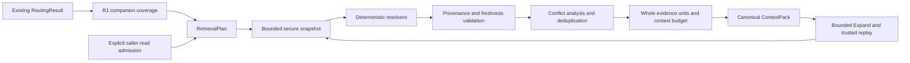

# Local context retrieval

The additive context retrieval layer lives inside CDO. It reads explicitly admitted sources and produces `context-pack.v1` evidence. It has no model, network, database, Temporal, execution, approval, publication or worktree port. The original `RoutingResult`, `ContractPlan`, planner output and approval fingerprint remain unchanged.



## R1 coverage and compatibility

`internal/planning/routing_coverage.go` provides `BuildRoutingMetadataWithCoverage`, `RoutingCoverageFromEvidence` and `ValidateRoutingCoverage`. Coverage is companion data and never enters an existing approval object. Reports bind source declarations, acquired evidence digest, route plus contract-plan output digest, catalog and exact bounded configuration. Declared Git identity remains UNVERIFIED; observed acquisition is not a complete immutable Git snapshot.

The ledger covers visited/indexed/excluded/unreadable/oversized inventory, repository/global acquisition, target file projection, symbols/imports, repository-facts bytes and required evidence omissions. Unknown subtree remainder is explicit. Display clipping is distinct from source scanning. Historical serialized routing without the companion has UNKNOWN acquisition coverage. The retained legacy planner wording must be interpreted with this companion; incomplete coverage cannot prove a missing test or contract.

A pre-implementation serialized PlannerOutput and approval fingerprint fixture proves that instrumentation preserves legacy output. Current reports are validated before CLI use; a route, contract-plan, catalog, config or diagnostic-digest mismatch rejects the report.

## Core and source admission

`internal/contextretrieval` uses standard-library types and read-only `SourceLoader` and `Resolver` ports. `internal/adapters/contextretrieval` composes filesystem, exact text, Go AST, existing metadata, portable architecture graph, contract and test adapters. Existing discovery inventory and HTTP/NATS syntax analyzers are reused through nil-default hooks; default discovery behavior and its checksum have regression coverage. No independent graph builder or second recursive scanner was added.

`BuildPlan` receives the existing route projection, task, purpose, sources, facets, budget, limits and separately registered policies. It copies routing decisions, creates exact/symbol/contract requirements and records missing admissions. Each source requires a stable identity, explicit root and nonempty literal read paths. Optional `route_identity` maps an existing route project ID to that source identity when they differ; `--root` and facet selectors use the source identity. This is explicit mapping, not an ownership or scope change. `.` admits the root; other paths admit an exact file or component-bounded subtree. Exclusions win. Globs are unsupported. Absolute roots are adapter inputs excluded from JSON and semantic digests. Stable source aliases and remote repository identities are suitable identities; absolute local path identities are rejected.

Every admitted source is forbidden for writes. Neighbor declarations only identify read-only evidence. Routing, graph links, source text and a base pack cannot admit another source, assign an owner or authorize an execution task. A graph reference is a reference, never an admission.

Filesystem snapshots hash the bounded admitted inventory, configuration, scope, content hashes and coverage, without mtime, latency or host root. Working-tree revisions use `snapshot:<digest>`. This is content identity, not a claim that Git is clean. Caller `dirty` remains explicit; a supplied Git revision cannot be independently certified by the filesystem adapter and produces UNVERIFIED diagnostics. Partial inventories remain partial even if a requested file was found.

Before opening source files, policy denies `.env*`, credential/token/key stores and excluded directories, including original and canonical root components. Explicit root aliases are canonicalized; source paths below the admitted canonical root use descriptor-relative `openat` with `O_NOFOLLOW` for every component. Hardlinks, relative symlink parents/files, unreadable mode, FIFOs and other nonregular files are rejected. Reads are bounded. A defensive content gate withholds secret-like content in otherwise ordinary files. Named-secret pre-open exclusions and content checks are separate protections. Temporary generated fixture data contains only synthetic placeholders.

## Resolvers and capabilities

| Resolver | Supported evidence | Limits of the claim |
|---|---|---|
| Exact | Explicit file, exact text, bounded docs fragments | Matching text does not establish semantic behavior |
| Go AST | Definitions, declarations, imports, syntax-based test association; existing HTTP/NATS route extraction | No type-aware callers/reference/implementation graph |
| Metadata | Existing `.ai` metadata and strict architecture manifests | Informal declarations remain factual data; cited paths/hashes are independently checked |
| Architecture | Explicit existing `architecture-graph.v1` export, canonical digest, stable IDs and declaration pins | Current local inputs must be admitted and match; captured Git revision and complete fleet/runtime symbols are not certified |
| Contract | Existing contract-owner facets, `contractref`, actual declared HTTP/event/schema evidence | Does not create or approve a freeze, infer ownership or certify implementation |
| Tests | Actual Go tests and existing test metadata/policy | Filename, lexical association and file presence do not certify test success |

`references`, `implementation`, `callers`, `error_mapping`, `schema` and `history` are recognized query kinds but their semantic capabilities are UNSUPPORTED in this release. Quote an explicit SQL/schema file using `exact` when that is sufficient; this does not claim a schema analysis capability. Missing resolver/capability, parser failure, clipping and unreadable evidence return explicit coverage and sanitized diagnostics. No lexical result is presented as a type-aware query.

Required facet states distinguish FOUND, NOT_FOUND_AFTER_COMPLETE_SEARCH, NOT_VERIFIED, OMITTED_BY_LIMIT, UNREADABLE, UNSUPPORTED and EXCLUDED_BY_POLICY. Required evidence absent after a complete search still leaves a requirement unresolved; only complete bounded search can establish the absence. Limits cannot turn unknown into absence.

## Trust, factual authority and freshness

Evidence records source identity/revision/snapshot, relative path, full-file hash, coherent byte/line span, symbol, resolver/version, query, provenance, claim type, authority, freshness, size, token estimate, limitations and links. Engine validation checks exact bytes against the admitted snapshot before quality analysis. Generated inputs and declaration citations use already-loaded source documents; a graph does not trigger reads outside admission.

Provenance classes are TRUSTED_POLICY, TRUSTED_PROJECT_METADATA, PROJECT_SOURCE, PROJECT_TEST, PROJECT_DOC, EXTERNAL_CONTENT and GENERATED_CONTENT. Source comments, README, docs, fixtures and incidental nested AGENTS are inert data. Markdown quotes evidence inside escaped JSON fences. Text inside evidence cannot change tools, network, models, scope, approval, policy or execution.

Instruction trust requires a caller-supplied registration of exact source identity, relative path, hash and applicability scope. A discovered AGENTS filename alone grants no trust. Scoped registrations apply only to corresponding task facets; unrelated registered policies do not become applicable rules. Applicable missing/changed/omitted registered bytes block the pack. The complete registry is bound into the policy digest.

Factual authority is claim-specific PRIMARY, SUPPORTING or CONTEXT, with a basis. Business ownership, intended public contract, actual implementation, database schema/query, metric semantics, testing policy, architecture rules and historical decisions use different source hierarchies. Authority does not grant instruction power. Claims require explicit keys and values; contradictory keys create `AuthorityConflict`. Arbitrary different text is not treated as a contradiction. Generated/external material remains contextual. Stale participants can survive as conflict IDs and diagnostic metadata, while their stale runtime content is withheld.

Freshness states are CURRENT, STALE, DIRTY_SNAPSHOT, UNVERIFIED, MISSING and INVALIDATED. Hash, revision, snapshot, expected hash and generated-input validation govern freshness; confidence, timestamps and TTL do not. Current source plus a stale expected checksum cannot silently win. Unknown/deleted input does not certify a generated projection. Captured graph Git labels are explicitly unverified under local working-tree snapshots, even when current declaration bytes match.

## Ranking, deduplication and budget

Ranking is deterministic: mandatory evidence, claim authority/freshness, exact match, owner/distance, supporting tests, then optional docs/history, with stable identity tie-breakers. No LLM or ML ranker is used.

Dedup keys include source, revision/hash, path, symbol/span, evidence kind and claim identity. Compatible overlapping spans of the same version merge only when their shared text agrees. Multiple resolver references become links. Different revisions, contracts and contradictory claim values never merge into one apparent fact.

Budget includes source bytes, full canonical JSON context estimate, reserved prompt tokens and per-facet/per-source bounds. Estimator `canonical-json-utf8-bytes-div4-ceil.v1` is deterministic and includes envelope overhead; it is an estimate, not a model tokenizer. Whole evidence units are retained or omitted, never broken JSON/source slices. Mandatory, policy and conflict evidence cannot vanish silently: budget failures are BLOCKED with BUDGET_UNSATISFIED and omissions. A diagnostic-only envelope can itself exceed an impossible tiny budget; it remains explicitly blocked rather than claiming compliance.

Expand retains the selected base and builds a union. Costs and depth are cumulative with no refund; prior selected evidence cannot be replaced to make room. If a required union fails budget, the blocked delta keeps the base. A positive `remaining_budget` value imposes an additional bound within the original capacity; zero means the original remaining capacity. Repeated failed queries cannot change the original pack or scope. Each invocation has bounded time, depth, results, file size/count, aggregate read bytes and symbol matches.

## ContextPack and Prepare / Expand

The model in `internal/contextretrieval/model.go` is the versioned JSON contract. Pack fields include schema/status/request/purpose, route reference, engine/policy/adapter versions, sources, owner repositories, layers, retrieval plan, applicable rules, symbol/code/contract/test/architecture evidence IDs, dependencies, forbidden scope, full evidence, coverage, unresolved questions, conflicts, omissions, budget and content digest. Markdown is a deterministic projection of JSON.

Semantic digest binds snapshot, route, task/plan, policy, adapter versions, evidence, diagnostics, omissions and cumulative source/depth state. It excludes operational request IDs and their derived wire-token length effect. Exact accounting is independently verified even where derived fields are excluded from the semantic digest. Absolute roots, timestamp and latency are absent. Same semantic input yields the same selected order and digest; source/route/policy changes invalidate it.

`Engine.Prepare(ctx, request)` validates the plan, loads one bounded snapshot, resolves facets from those documents, verifies candidates and citations, rechecks the snapshot, analyzes quality and builds the pack plus a sanitized trace. Mutation during retrieval rejects the result. Trace includes IDs/digests, versions, query kinds, counts, omissions, status, conflicts, bytes/tokens, latency, cache-hit and expand count; no raw evidence, prompts or secrets are logged.

`Engine.Expand(ctx, base, currentRequest, expandRequest)` requires current caller admissions, route and policy again. It verifies the base digest/accounting, unchanged configuration, live snapshots and the initial Prepare plus bounded expansion history through deterministic replay. Editing a cached pack and recomputing its digest cannot promote provenance or reset counters. Replay is bounded by the same invocation deadline/depth and reads only the same admitted sources. There is no authoritative persistent cache, approval store or hidden source discovery. A caller can intentionally start another Prepare; these counters are package-relative budgets, not a global billing quota.

Stale base returns `ErrStaleBase`; changed admission returns `ErrScopeChange`; malformed input/cache returns `ErrInvalidRequest`. Unsupported queries remain explicit in the returned delta/pack. Blocked delta status and diagnostics are retained in JSON and Markdown even when the retained base pack was COMPLETE.

## Offline CLI and verification

The three commands dispatch before `config.Load`, so they do not load `.env`, DB/Temporal settings or model credentials:

```text
course-dev-orchestrator context-prepare --request-json request.json --route-json route.json \
  --contract-plan-json contract-plan.json --routing-coverage-json routing-coverage.json \
  --root owner=/absolute/admitted/root [--root neighbor=/absolute/admitted/neighbor] \
  [--format json|markdown]

course-dev-orchestrator context-expand --request-json request.json --route-json route.json \
  --contract-plan-json contract-plan.json --routing-coverage-json routing-coverage.json \
  --root owner=/absolute/admitted/root --base-pack-json pack.json --expand-json expand.json \
  [--format json|markdown]

course-dev-orchestrator context-evaluate --fixtures-dir test/fixtures/context-retrieval/gold
```

Contract plan and R1 companion are optional inputs. Without the companion, historical routing acquisition remains UNKNOWN/PARTIAL. Each admitted identity needs one explicit current `--root`; additional roots are rejected. Input JSON is bounded, strict, one object, no unknown fields; descriptor-safe checks deny named secrets, symlinks, hardlinks, unreadable/nonregular files before content reads. Output is stdout; saving it is an explicit caller action. There are no cache writes in managed sources and no `.cache` trust root.

Minimal request JSON (the CLI replaces `route` with the supplied existing route):

```json
{
  "schema_version": "context-pack.v1",
  "request_id": "review-001",
  "task": "Inspect the handler and its tests",
  "purpose": "review",
  "sources": [{"identity": "owner", "read_paths": ["internal", ".ai"], "exclude_paths": ["internal/generated"]}],
  "required_facets": [{"id": "handler", "kind": "source", "query_kind": "definition", "source_identity": "owner", "path": "internal/http/handler.go", "symbol": "Handle", "claim_type": "implementation_behavior"}],
  "optional_facets": [{"id": "tests", "kind": "test", "query_kind": "tests", "source_identity": "owner", "path": "internal/http/handler.go", "symbol": "Handle", "claim_type": "implementation_behavior"}],
  "budget": {"max_source_bytes": 131072, "max_context_tokens": 16384, "reserved_prompt_tokens": 1024},
  "limits": {"max_files": 500, "max_file_bytes": 262144, "max_total_bytes": 8388608, "max_depth": 24, "max_results": 100, "max_symbol_matches": 50, "max_expand_depth": 4, "max_duration_millis": 10000}
}
```

An expansion supplies a new unique facet, selector, reason and optional lower remaining budget:

```json
{"facet":{"id":"handler-imports","kind":"imports","query_kind":"imports","source_identity":"owner","path":"internal/http/handler.go","claim_type":"implementation_behavior"},"reason":"Inspect static dependencies","remaining_budget":{}}
```

Declared targets are `context-test`, `context-format`, `context-build`, `context-gold`, existing `planner-route-test`, control-plane checks and full `verify`. Go caches remain repository-local. The root Makefile automatically includes `.env`; secret-free verification uses a temporary copy that removes only the exact initial include block, and Compose receives `--env-file /dev/null` with synthetic defaults. No secret file is read or changed to run these checks.

## Gold evaluation

`internal/contextretrieval/evaluation` runs versioned `retrieval-gold/v1` JSON fixtures in isolated synthetic temporary sources. Fixtures inside `test/fixtures/context-retrieval/gold` independently label expected services/layers/contracts/tests, must/should/forbidden selectors, forbidden writes, diagnostics/status, conflicts, counters and budgets. Modes exercise real Prepare, Expand, quality/packing and the existing R1 collector. Direct quality cases test adversarial resolver output without pretending it came from a filesystem. R1 cap cases assert observed counters, including mandatory evidence acquired then omitted by global projection.

Metrics retain numerators and denominators: safety must-find recall, overall recall, precision, forbidden scope, missing contracts, silent missing contracts, tokens, duplicate ratio, source revision freshness, conflicts surfaced, latency and coverage statuses. Deliberately missing contracts are reported in the raw missing-contract rate; the silent-missing gate separately requires an explicit matching diagnostic. Gold includes negative fault-injection tests of the evaluator so fabricated COMPLETE, hidden stale/authority gaps and self-labelled relevant evidence cannot pass silently.

Hard gates require safety/contract must-find recall 1.00, zero forbidden violations, silent missing required contracts, stale runtime leaks, silent conflict suppression and false COMPLETE; precision target is at least 0.80. Timing is measured rather than part of semantic determinism. The suite makes no model/API/network calls.

## Boundaries and next rollout

This release does not integrate live Contract/Worker/Reviewer prompts or alter sandbox admission, production gates, business WorkPackages, contract freeze, distribution, global skills or other repositories. It creates no service, daemon, MCP server, vector store, embeddings or ML ranking. Vector DB is NOT REQUIRED.

Known limits are explicit bounded-search completeness, syntax-level Go analysis, lexical contract/test association, local snapshot identity without Git blob certification, claim conflicts requiring declared comparable keys/values, conservative generated-input validation, unsupported non-Go semantic tooling and approximate tokens. Portable graph declarations do not certify runtime callers or a complete fleet. Current file bytes do not prove truth of informal assertions. The next stage is a separately approved read-only service pilot; it is not executed by this program.

## Historical implementation verification — 2026-10-06

The following report records the original dirty working tree before publication. Its commit/push fields and Python runner counts are historical; they do not prove an isolated publication tree.

```yaml
CONTEXT_RETRIEVAL_IMPLEMENTATION_RESULT:
  OVERALL_STATUS: COMPLETE
  GOAL: Additive local read-only R1-R4 pipeline plus deterministic offline Gold inside CDO
  IMPLEMENTED:
    R1:
      status: COMPLETE
      components: companion coverage for inventory/acquisition/targets/symbols/facts/required omissions; bound validation
      tests: caps and failure fixtures; pre-change serialized PlannerOutput and approval fingerprint golden
    R2:
      status: COMPLETE
      components: generic models, BuildPlan, explicit read admission, immutable observed snapshot ports
      resolvers: metadata, exact/docs, Go AST, existing architecture graph, contracts, tests
      tests: core/adapters/discovery/routing/CLI; nil-hook legacy checksum regression
    R3:
      status: COMPLETE
      provenance: seven strict classes; registered scoped policy only; source text inert
      authority: eight claim types; explicit conflict objects and retained conflict references
      freshness: hashes/revisions/snapshot/input pins; unknown and dirty explicit
      ranking: deterministic mandatory/authority/freshness/exact/distance/test ordering
      dedup: same-version coherent overlap; revisions and conflicting claims separate
      budget: whole units; canonical envelope/reserve; source/facet/source/cumulative bounds
      ContextPack: context-pack.v1 canonical JSON and deterministic Markdown
      tests: security, provenance, conflicts, freshness, dedup, budgets, digest/accounting
    R4:
      status: COMPLETE
      CLI: context-prepare, context-expand, context-evaluate before config loading
      Prepare: bounded snapshot, resolver coverage, exact-span validation, final snapshot recheck
      Expand: fresh admission, live snapshot, deterministic trusted replay, cumulative limits, explicit delta diagnostics
      tests: command security/current R1 chain, stale/forged cache, scope, budget/depth, JSON/Markdown; built binary smoke
  GOLD:
    status: COMPLETE
    fixture_count: 71
    scenario_count: 71
    adversarial_count: 12
    metrics:
      recall: 34/34
      precision: 36/36
      authority_conflicts_surfaced: 4/4
      context_token_count_sum: 62185
      retrieval_latency_millis_one_run: 155.274
      case_statuses: {COMPLETE: 21, PARTIAL: 37, BLOCKED: 10, INVALID: 2, STALE: 1}
  QUALITY_GATES:
    must_find_recall: 1.00
    forbidden_scope_violations: 0
    missing_contract_rate: 0.25 # 1/4 intentional absence; matched explicit diagnostic
    silent_missing_required_contracts: 0
    stale_evidence_leaks: 0
    silent_authority_conflicts: 0
    false_complete_cases: 0
    precision: 1.00
    duplicate_ratio: 0
  BACKWARD_COMPATIBILITY:
    RoutingResult: UNCHANGED
    route_polarity: UNCHANGED
    ContractPlan: UNCHANGED
    approval_fingerprints: PRE_CHANGE_GOLDEN_PASS
    existing_workflows: FULL_VERIFY_PASS
  OFFLINE: {model_required: NO, network_required: NO, external_service_required: NO}
  OTHER_REPOSITORIES_MODIFIED: NO
  VECTOR_DB: NOT_REQUIRED
  KNOWN_LIMITATIONS: bounded observed snapshots; Git labels unverified; lexical test/contract association; approximate tokens
  UNSUPPORTED_CAPABILITIES: type-aware references/implementation/callers; semantic error_mapping/schema/history; non-Go semantic tooling
  FILES_CHANGED:
    - internal/planning/routing.go, routing_coverage.go, routing_coverage_test.go
    - internal/discovery/scanner.go, retrieval.go
    - internal/contextretrieval models/plan/engine/quality/pack and tests
    - internal/contextretrieval/evaluation runner/schema/metrics and tests
    - internal/adapters/contextretrieval filesystem/exact/Go/project/metadata/graph/contracts/tests and integration tests
    - cmd/course-dev-orchestrator/main.go, context_retrieval.go, context_retrieval_test.go
    - test/fixtures/context-retrieval routing compatibility, CLI and 71 Gold JSON cases plus schema/README
    - Makefile, .ai/commands.yaml, .ai/service.yaml
    - docs/README.md, agent-context-retrieval.md, agent-context-retrieval-audit.md, progress.md
  VERIFICATION:
    - focused context-test PASS; planner/control-plane regressions PASS; CLI build PASS
    - full verify PASS using exact temporary .env-include-free Makefile and Compose --env-file /dev/null
    - Go vet/all Go tests PASS; Python runner 40/40; UI 17/17; runner and UI builds PASS
    - env -i CLI Prepare/Expand/Gold PASS; repeated Prepare byte-identical and digest-identical
    - historical smoke PARTIAL/ROUTING_COVERAGE_UNKNOWN; fresh actual R1 companion COMPLETE regression PASS
    - independent review PASS with no remaining P0/P1
  UNRELATED_DIRTY_FILES_PRESERVED: original work retained; nine concurrent unrelated lifecycle/runner edits observed and not reverted
  COMMITS: NONE
  PUSH: NONE
  NEXT_RECOMMENDED_STAGE: separately approved read-only service pilot; NOT EXECUTED
```

Verification output is disposable under `.cache/agent-context`: `verification-gold.json`, `verification-manifest.json`, `smoke-pack.json` and `smoke-delta.json`. The source fixtures, schema, tests and this result are the reviewable durable evidence. The CLI smoke digest was `4f35782ea1e495833ee859a7ef545bec4c8dcc325e5dab8ba2ce2ec33d852bec`; Expand produced `1cfed05854601a4c58ab7a80f1f9439d2373bfaa8e10a7bcd5c40c3d895876da`. Full verification did not invoke separately gated DB/MVP/real-model/OCI production certifications.

## Exact publication verification — 2026-10-06

The isolated candidate starts at upstream `ef4c34e7b21481fa151dadd9a0464a0b630c00a4` and the independently verified prerequisite commit `213cbbea21c61ac524317d1802485f71de747f16`. Prerequisites include canonical catalog/assets, routing and contract verification APIs, required baseline domain declarations, narrow planner wiring and Docker catalog packaging. Shard/fanout, sandbox, lifecycle, release certification and unrelated user changes are excluded.

Both prerequisite-only and complete retrieval trees passed secret-free full verification. The prerequisite tree also passed the pre-R1 serialized planner output and approval fingerprint golden. Final retrieval checks passed formatting, Go vet/all tests, focused routing/catalog/contracts/retrieval tests, CLI build, 71 Gold fixtures (12 adversarial), offline Prepare/Expand and byte-identical repeated Prepare/digest. Recall and precision are 1.00; forbidden scope, silent missing required contracts, stale leaks, silent authority conflicts and false COMPLETE are zero. The expected explicit missing-contract case retains raw rate 0.25. Independent reviews report P0=0 and P1=0.

Full verification uses the current upstream Makefile with only its automatic `.env` include omitted, repository caches, offline Go modules, and Compose `--env-file /dev/null`. Git fixture subprocesses receive no global Git environment overrides. Build VCS stamping is disabled for the plain isolated filesystem candidate; source and logical Git trees are compared directly. Fixture/provider-dependent DB, live model and production certification gates are outside this publication. Verification evidence and the final commit/push/remote proof are retained under ignored `.cache/agent-context/publication-v2`; publication succeeds only after normal push and verified local/remote SHA equality.

## First Go wave remediation snapshot (before closure v2)

The project adapter treats a routing file's comma-separated symbol inventory as
one checksum-bound whole-file selector. An actual single-symbol selector keeps
its semantics. `AdaptTaskRoute` uses explicit caller facets to choose evidence
within the admitted routing boundary, retaining all ContractPlan obligations,
source checksums, ownership, constraints and R1 outcomes. Unscoped requests keep
routing seeds as defaults. The offline CLI consumes this projection; the
RoutingResult, Prepare/Expand and ContextPack v1 contracts remain unchanged.

R1 acquisition extraction and omission rows are grouped only when source,
stage and safety state agree; additive counts are summed. Individual required
outcomes, limit reasons, unknown remainder and the full companion digest remain
visible. COMPLETE named-path policy exclusions are a separately count- and
hash-bound ledger in the pack. Facet-specific exclusions and all incomplete,
secret-content, stale and authority outcomes remain individual. The full R1 and
loader ledgers must be kept as external verification artifacts; a compact
projection does not certify Git history or authorize a write.

The bounded routing inventory acquires root stack/owner files and interleaves
repository subtrees, giving canonical internal layers separate lanes. Existing
visited/file/byte bounds and unknown remainder accounting still apply. A missing
layer after incomplete acquisition is unverified, not established absence.
The Go canonical catalog 1.3.1 supports owner-declared outbound
`internal/infrastructure/http/**` packages only when directional YAML and actual
Go AST HTTP client calls agree. This is syntax evidence, not type-aware or
runtime certification. Exact `*_test.go` selectors exclude sibling files;
implementation-file association remains a bounded syntax heuristic.

The unchanged 71 serialized Gold cases are complemented by integration Gold
regressions for these five blockers, including short/overlong inventories,
large R1 and named-policy envelopes, exact/missing test paths, metadata
saturation, and outbound/inbound negatives. `TestWave1Replay` materializes the
safe six-owner corpus in `test/fixtures/context-retrieval/wave1`, validates all
content hashes, and executes real routing → bound R1 → task adaptation →
Prepare/Expand for 39 original tasks. It asserts supported mandatory recall,
independent file-level precision, explicit unsupported/missing/excluded
outcomes, read admission, forbidden writes, freshness and canonical accounting.
Raw acceptance results are saved to `.cache/wave1-results.json`; a passing
regression test does not turn a known diagnostic or original layer mismatch into
a passing readiness gate. Captured exclusion ledgers contain no excluded bytes.

Original labels are preserved. Proposed canonical layer-name corrections and
lexical SQL fallbacks are separate, unapplied proposals. Semantic SQL, callers
and official `average_grade` remain unsupported or owner-contract gaps. Auth's
mandatory secret-excluded signin test remains a visible recall failure. No
service business/runtime code, instruction trust or content policy is changed.

## Go Wave 1 capability acceptance v2

`wave1-capability-acceptance/v2` is a separate, independently audited overlay.
Original 39 task definitions, required labels and their 166/205 denominators stay
immutable. Requested route responsibilities are distinguished from unchanged
implementation, contract and test dependencies that must still be retrieved.
Each applied `EXPECTED_LABEL_WAS_WRONG` correction cites source, architecture,
profile, repository policy, contracts and tests in the versioned audit corpus.
Owner identity is exact; route layer comparison also rejects unexpected extras.

The evaluator partitions every original evidence occurrence and separately
checks every required facet of the resulting plan, including generated route,
contract and policy obligations. `SUPPORTED_REQUIRED` requires selected current
facet-bound evidence. Unsupported semantics require explicit unsupported
coverage/diagnostics; selected lexical bytes cannot satisfy that facet. Security
exclusion requires `REQUIRED_EVIDENCE_EXCLUDED_BY_SECURITY` and policy-excluded
coverage. Secret policy is unchanged, and excluded Auth assertion bytes are never
part of the corpus. The Auth owner must supply a safe assertion source.

A missing business contract requires independent contract-absence evidence.
An incomplete broad inventory remains NOT_VERIFIED. A separate complete scoped
resolver search may establish the narrower absence; its snapshot and coverage
are reported separately without upgrading the original ContextPack. No official
`average_grade` producer, dataset, payload, scale, null or aggregation contract
was found in the frozen admitted corpus. This yields `MISSING_METRIC_CONTRACT`,
not a new DTO or metric calculation. Retained User identity compatibility versus
Auth login identity authority remains `BUSINESS_OWNERSHIP_DECISION_REQUIRED`.
Auth, User and RBAC owners remain distinct.

`lexical-sql-capability/v1` formalizes the existing `exact.v1` + `QueryExact`
equivalent: exact admitted migration files and case-sensitive literal table,
column, DDL, query and repository-reference strings. Semantic SQL remains
UNSUPPORTED; an explicit lexical follow-up does not reinterpret the original
semantic request. ContextPack ABI and original Gold v1 semantics are unchanged.

Routing now scopes an existing-dependency qualifier to its context, preserves
explicitly requested responsibilities despite metadata frequency, and prefers
specific responsibility phrases over their generic substrings. Named qualified
Go declaration/selector syntax can locate an admitted containing-file layer;
it does not certify receiver types, dynamic dispatch or a caller graph. DDL is
an inspection artifact, not a reverse Go import from persistence to migration.

Acceptance PASS certifies these bounded retrieval obligations, not execution
approval, full unbounded acquisition, or COMPLETE pack status. Valid unsupported,
security, business and owner results retain their diagnostic and pack status.
